# Estimación de oxígeno medicinal requerido para casos severos y críticos por COVID-19 en Perú

## Antecedentes

La enfermedad por coronavirus (COVID 19) es una ‎enfermedad infecciosa causada por un ‎coronavirus recientemente descubierto. ‎

La mayoría de las personas que enferman de ‎COVID 19 experimentan síntomas de leves a ‎moderados y se recuperan sin tratamiento ‎especial. 

El virus que causa la COVID‑19 se transmite principalmente a través de las gotículas generadas cuando una persona infectada tose, estornuda o espira. Estas gotículas son demasiado pesadas para permanecer suspendidas en el aire y caen rápidamente sobre el suelo o las superficies.

Usted puede infectarse al inhalar el virus si está cerca de una persona con COVID‑19 o si, tras tocar una superficie contaminada, se toca los ojos, la nariz o la boca. [[1]]

## Proceso

Este proyecto se desarrolló en Python 3.8.5 usando los paquetes **pandas**, **datetime**, **numpy**, **epiweeks**, **matplotlib**, **seaborn** y **prophet**.

### Adquisición de Datos

Obtuve las cifras de casos confirmados de COVID-19 actualizadas a la fecha **2021-07-03** de la Plataforma Nacional de Datos Abiertos del Gobierno de Perú. Los conjuntos de datos utilizados están disponibles en el repositorio "Casos positivos por COVID-19" del Ministerio de Salud [[2]].

Los datos sobre el flujo de oxigeno medicinal requerido para casos severos y críticos los obtuve de la publicación "Oxygen sources and distribution for COVID-19 treatment centres: interim guidance" de la Organización Munidal de la Salud [[3]].

Para conocer la proporción de casos severos y críticos entre los pacientes me base en lo descrito en la página "Respuesta a la emergencia por COVID-19 en Perú" de la Organización Panamericana de la Salud [[4]].

### Transformación de Datos

Primero eliminé todos los registros sobre casos confirmados de COVID-19 que no tenian fecha asociada, provincia o departamento del conjunto de datos. Así mismo me aseguré de que todos los registros esten categorizados de acuerdo a los 24 departamentos del Perú.

Luego fue necesario agrupar los casos confirmados en semanas debido a que no todos los días tenian registros de casos confirmados y esta agrupación se hizo empleando semanas epidemiológicas basadas en los sistemas de numeración de semanas de CDC (MMWR) e ISO.

### Materiales

Para el desarrollo del modelo predictivo hice uso de Facebook Prophet, el cual se describe como un procedimiento para pronosticar datos de series de tiempo basado en un modelo aditivo en el que las tendencias no lineales se ajustan a la estacionalidad anual, semanal y diaria, además de los efectos de las vacaciones. Funciona mejor con series de tiempo que tienen fuertes efectos estacionales y varias temporadas de datos históricos. Prophet es robusto ante los datos faltantes y los cambios en la tendencia, y normalmente maneja bien los valores atípicos. [[6]]

### Modelo predictivo

Tomando como base lo expuesto en el repositorio "Análisis de oleadas de defunciones por COVID-19 en Perú" de mi autoría [[5]] se consideraron 2 periodos para la generación del modelo. El primero y más relevante tiene una duración aproximada de 8 meses, este periodo encapsula lo que internacionalmente se reconoce como una "ola COVID". El siguiente periodo de 4 meses simplemente busca descomponer este periodo largo en 2 partes.

Dada la cantidad de datos disponibles para la generación del modelo opte por hacerlo a nivel departamental. Hacerlo a nivel de país provocaría un subajuste y a nivel distrital, un sobreajuste.

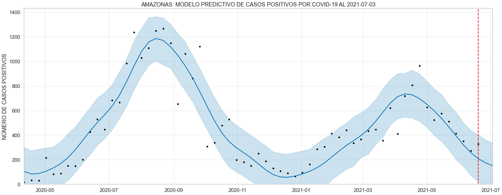

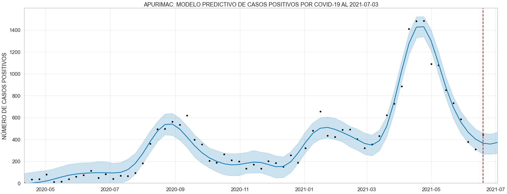

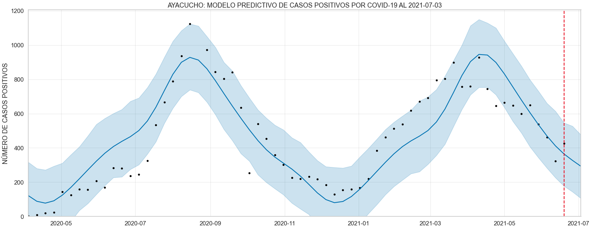

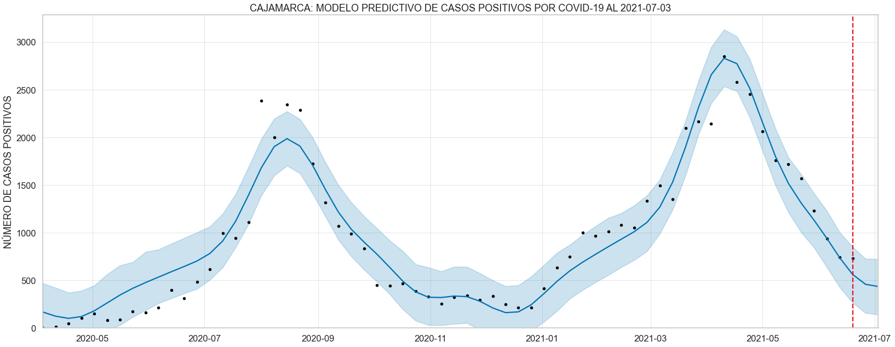

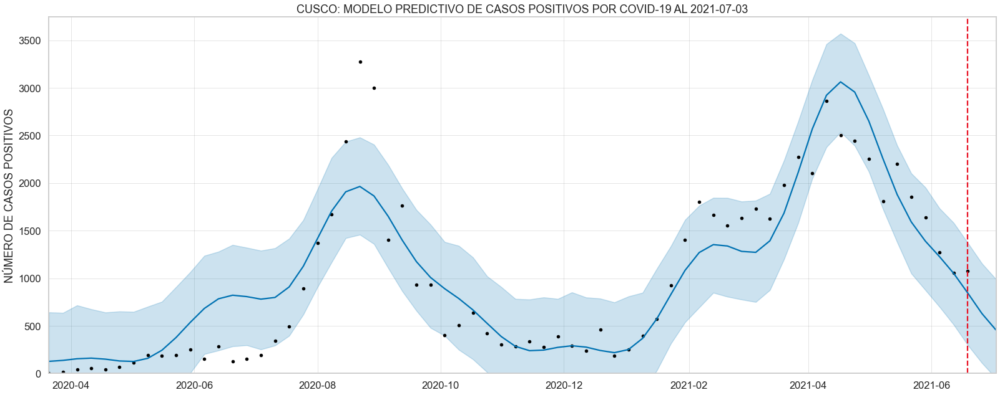

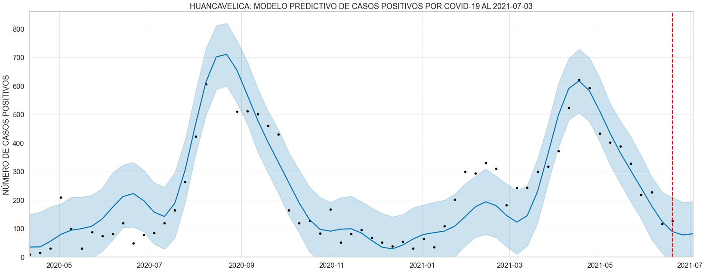

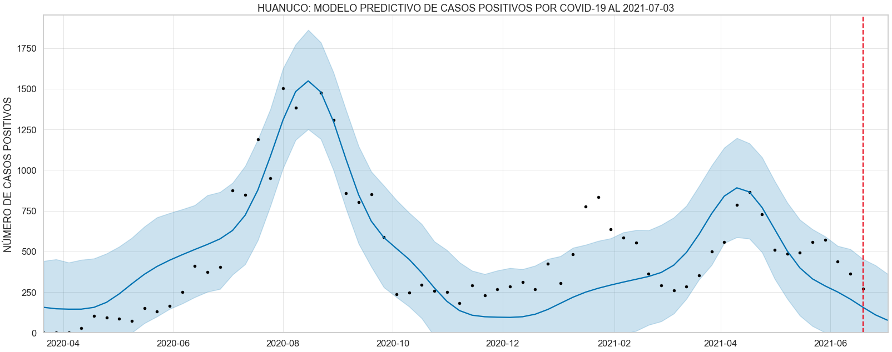

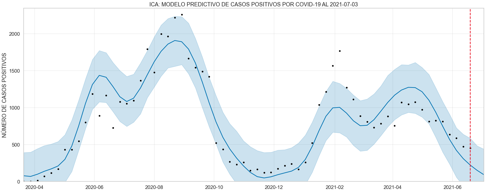

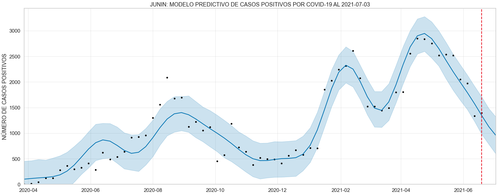

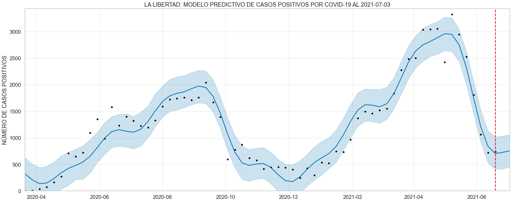

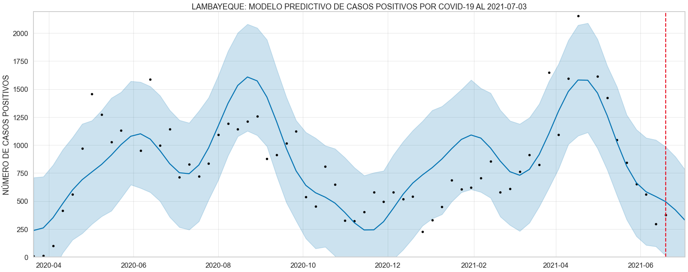

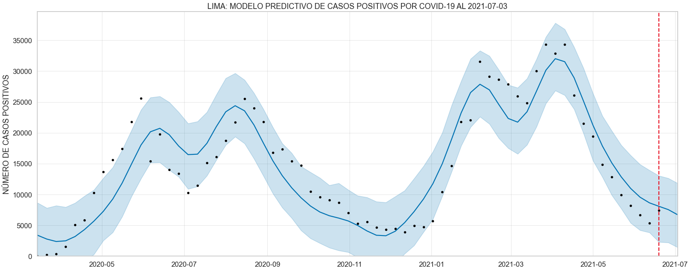

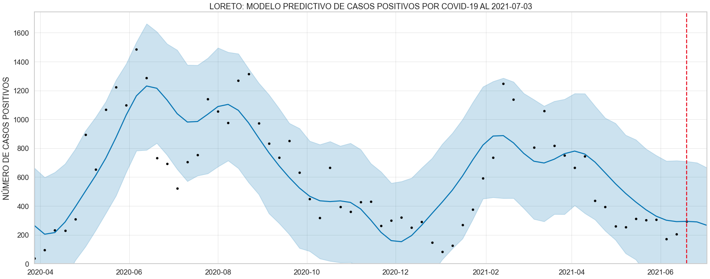

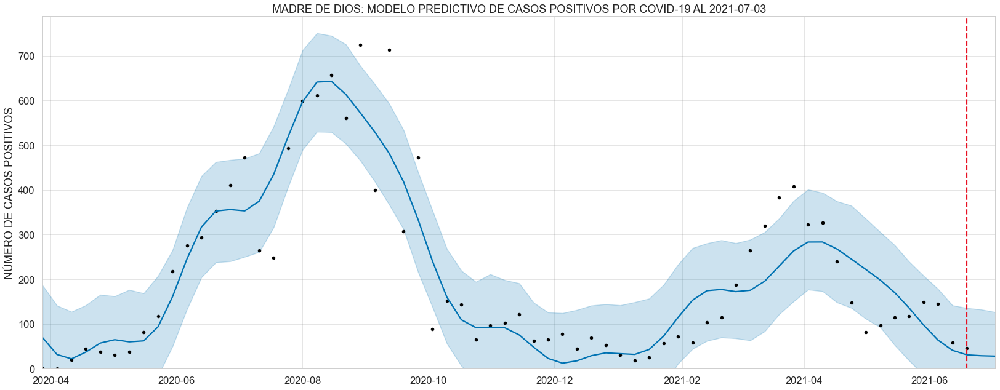

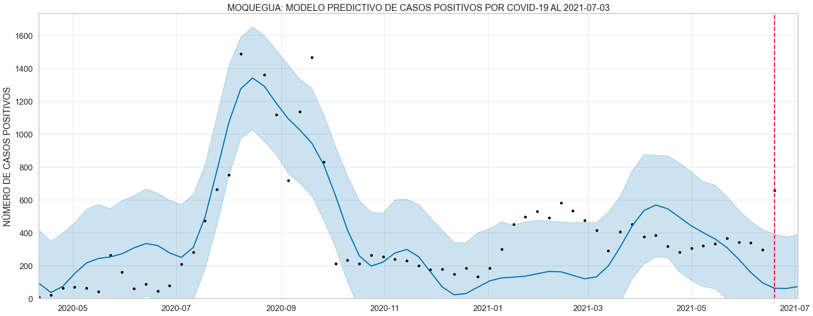

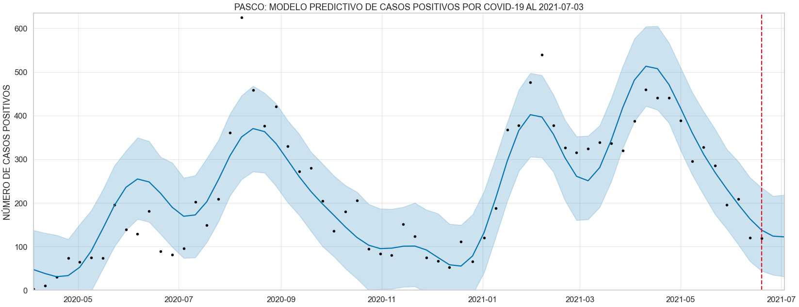

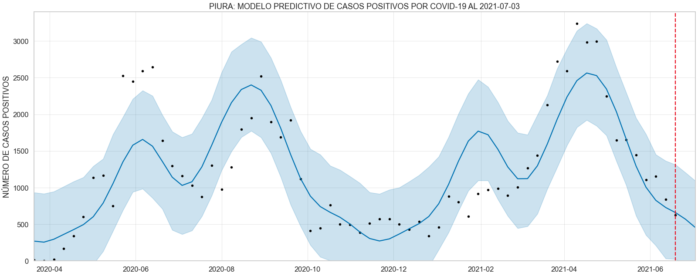

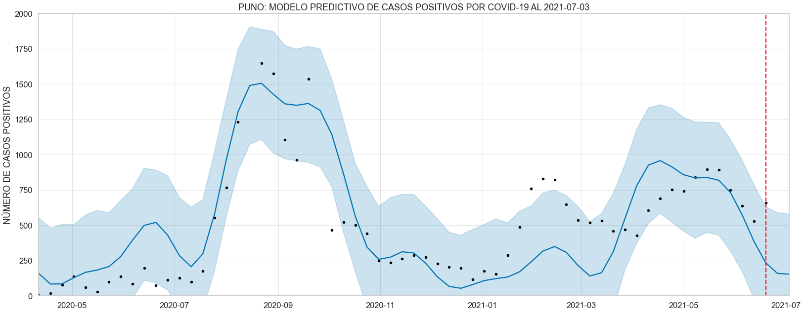

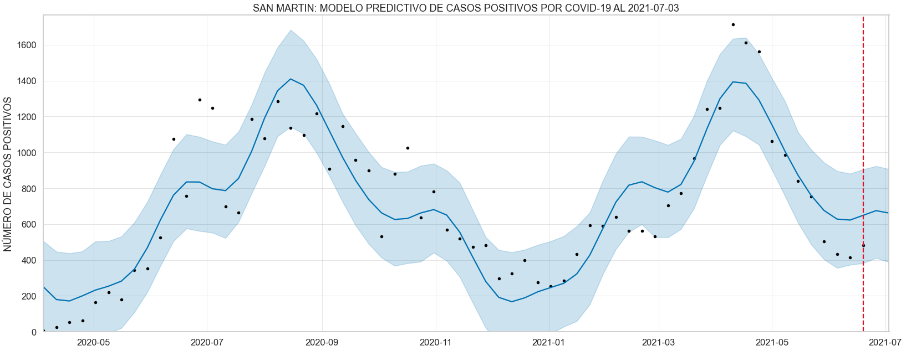

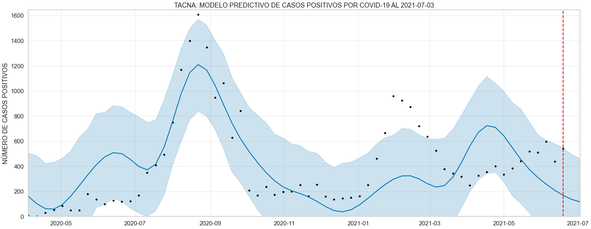

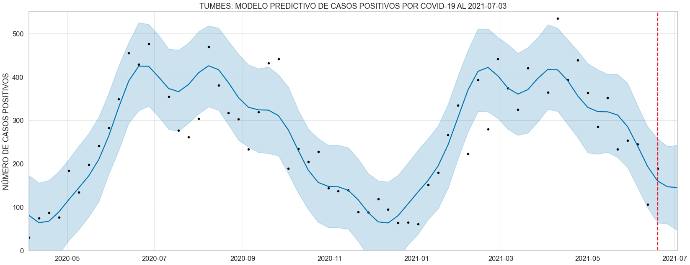

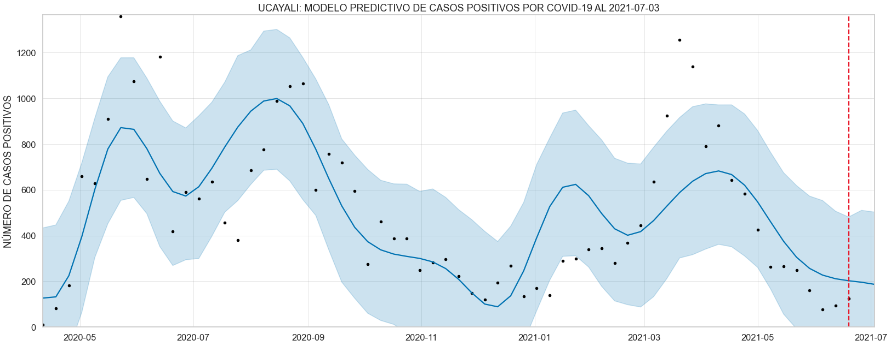

## Resultados

Según la OMS, el flujo de oxígeno requerido en promedio para los casos severos y críticos es de 10 L/min y 30 L/min respectivamente. La OPS indica que, en Perú, el 81% de los casos positivos por COVID-19 parecen ser leves, cerca de 14% parece devenir en un cuadro grave o severo y alrededor de 5% son casos críticos.

La estimación de oxígeno medicinal requerido por departamento se calculó empleando los datos de la OMS, la OPS y el modelo predictivo de casos positivos por COVID-19 por departamento con 

| DEPARTAMENTO   | FECHA PRONÓSTICO   |   PROD. RECOMENDADA |   PROD. IDEAL |
|:---------------|:-------------------|--------------------:|--------------:|
| AMAZONAS       | 2021-07-03         |            57.0455  |      119.021  |
| ANCASH         | 2021-07-03         |           307.059   |      396.502  |
| APURIMAC       | 2021-07-03         |           127.179   |      160.086  |
| AREQUIPA       | 2021-07-03         |           255.981   |      663.307  |
| AYACUCHO       | 2021-07-03         |           107.846   |      178.768  |
| CAJAMARCA      | 2021-07-03         |           155.608   |      252.223  |
| CUSCO          | 2021-07-03         |           188.452   |      370.376  |
| HUANCAVELICA   | 2021-07-03         |            27.7488  |       67.2842 |
| HUANUCO        | 2021-07-03         |            32.2031  |      134.161  |
| ICA            | 2021-07-03         |            42.3545  |      164.742  |
| JUNIN          | 2021-07-03         |           361.237   |      477.742  |
| LA LIBERTAD    | 2021-07-03         |           257.706   |      365.686  |
| LAMBAYEQUE     | 2021-07-03         |           130.598   |      293.76   |
| LIMA           | 2021-07-03         |          2480.35    |     4234.05   |
| LORETO         | 2021-07-03         |            96.5934  |      239.225  |
| MADRE DE DIOS  | 2021-07-03         |             9.90529 |       46.1353 |
| MOQUEGUA       | 2021-07-03         |            23.6776  |      134.914  |
| PASCO          | 2021-07-03         |            42.7948  |       74.9989 |
| PIURA          | 2021-07-03         |           178.459   |      391.706  |
| PUNO           | 2021-07-03         |            54.45    |      191.899  |
| SAN MARTIN     | 2021-07-03         |           232.661   |      324.608  |
| TACNA          | 2021-07-03         |            43.7413  |      170.901  |
| TUMBES         | 2021-07-03         |            50.7961  |       83.7767 |
| UCAYALI        | 2021-07-03         |            66.5973  |      171.13   |

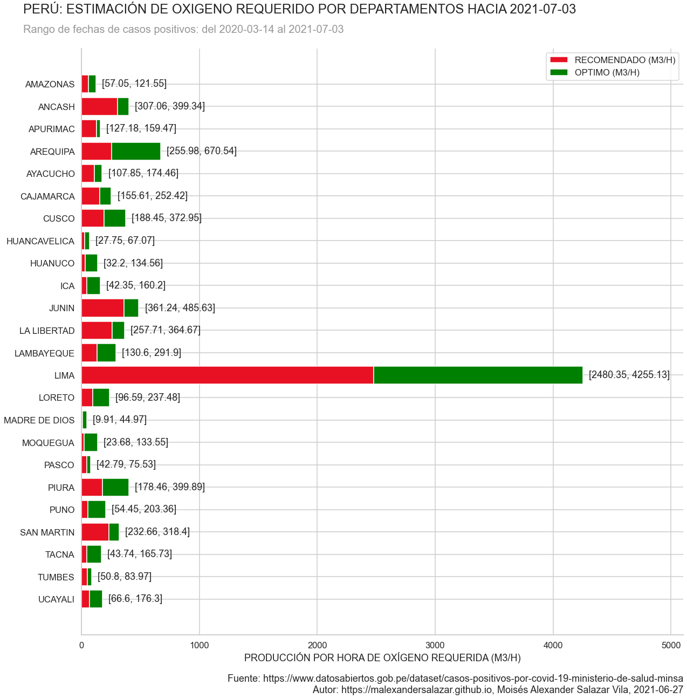

En el caso de las provincias lo que hice fue calcular el ratio entre los casos positivos actuales y futuros indicados por el modelo predictivo según sea el departamento para con ese ratio calcular la producción recomendada o ideal de acuerdo al último acumulado semanal de casos positivos en la provincia.

Este procedimiento solo aplicó para las provincias que tenían los datos actualizados hasta la última semana en concordancia con los datos a nivel departamental. Las provincias que no cumplieron con este criterio fueron filtradas del consolidado.

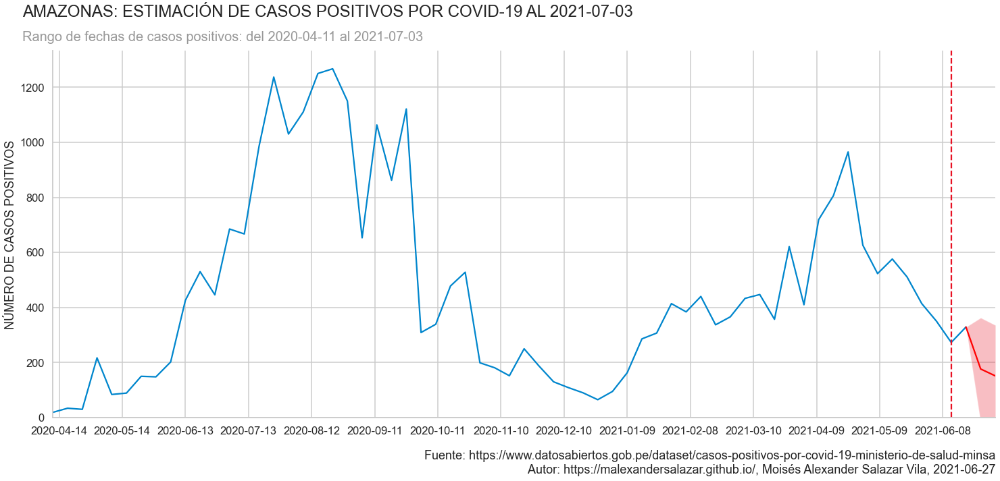

| PROVINCIA            | FECHA PRONÓSTICO   |   PROD. RECOMENDADA |   PROD. IDEAL |
|:---------------------|:-------------------|--------------------:|--------------:|
| BAGUA                | 2021-07-03         |            19.1681  |      28.959   |
| BONGARA              | 2021-07-03         |             5.39103 |       8.14473 |
| CHACHAPOYAS          | 2021-07-03         |            21.2646  |      32.1264  |
| CONDORCANQUI         | 2021-07-03         |             2.99501 |       4.52485 |
| LUYA                 | 2021-07-03         |             7.18803 |      10.8596  |
| RODRIGUEZ DE MENDOZA | 2021-07-03         |             3.29452 |       4.97734 |
| UTCUBAMBA            | 2021-07-03         |            38.9352  |      58.8231  |

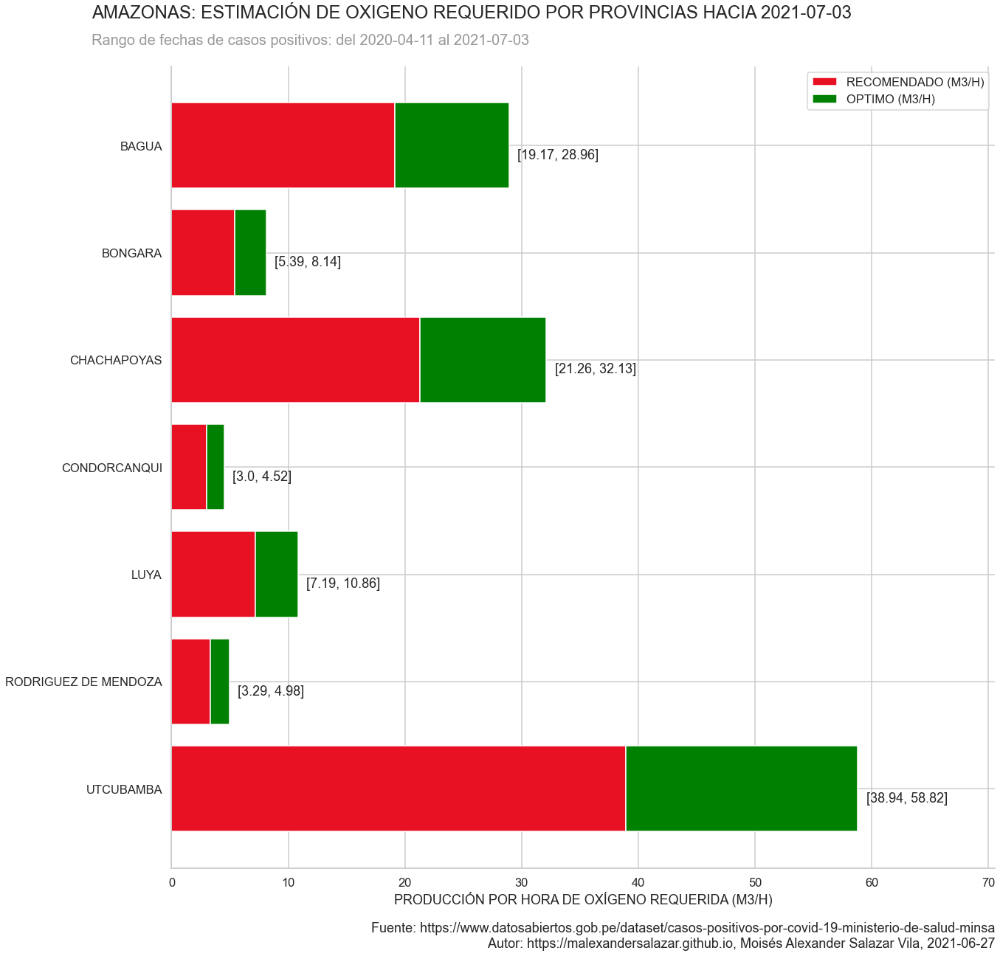

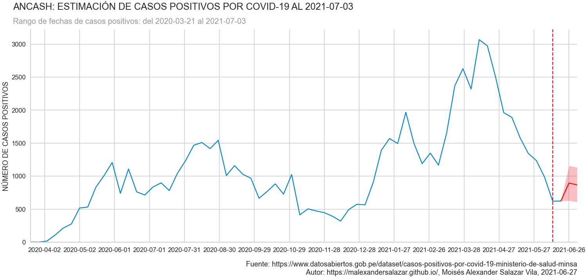

| PROVINCIA        | FECHA PRONÓSTICO   |   PROD. RECOMENDADA |   PROD. IDEAL |
|:-----------------|:-------------------|--------------------:|--------------:|
| ANTONIO RAIMONDI | 2021-07-03         |            2.04345  |      2.35064  |
| ASUNCION         | 2021-07-03         |            0.340574 |      0.391773 |
| BOLOGNESI        | 2021-07-03         |            7.83321  |      9.01078  |
| CARHUAZ          | 2021-07-03         |            3.40574  |      3.91773  |
| CASMA            | 2021-07-03         |            3.74632  |      4.3095   |
| HUARAZ           | 2021-07-03         |           54.8325   |     63.0754   |
| HUARI            | 2021-07-03         |            9.87666  |     11.3614   |
| HUAYLAS          | 2021-07-03         |           21.7968   |     25.0735   |
| PALLASCA         | 2021-07-03         |            6.81149  |      7.83546  |
| POMABAMBA        | 2021-07-03         |           13.623    |     15.6709   |
| RECUAY           | 2021-07-03         |            5.10862  |      5.87659  |
| SANTA            | 2021-07-03         |           60.9628   |     70.1273   |
| SIHUAS           | 2021-07-03         |            8.17379  |      9.40255  |
| YUNGAY           | 2021-07-03         |           10.8984   |     12.5367   |

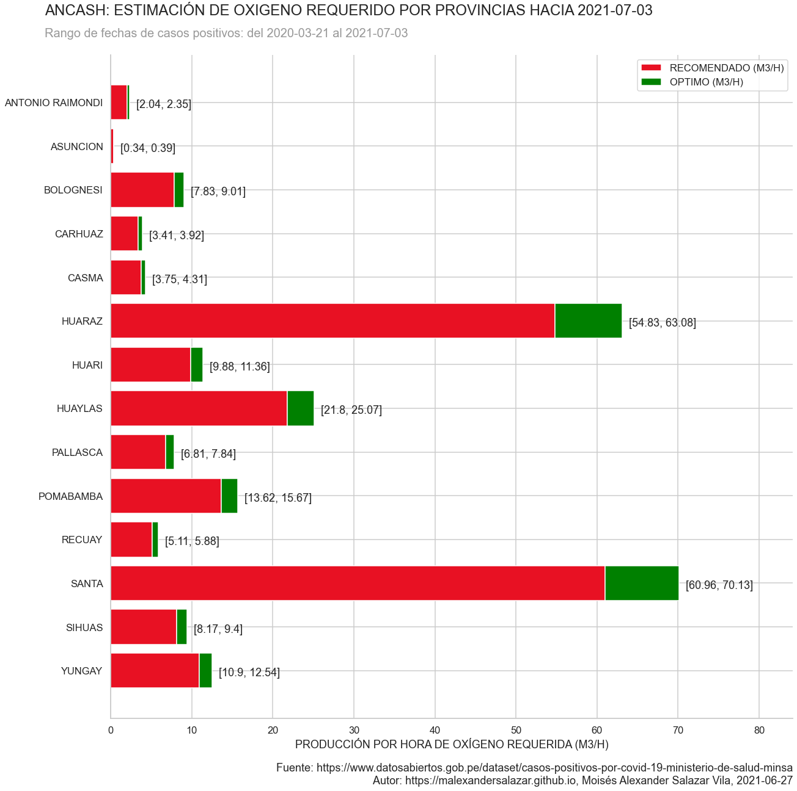

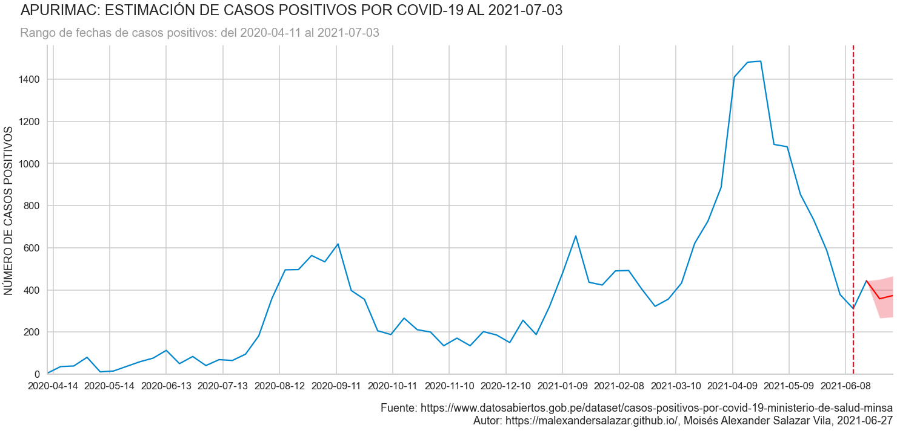

| PROVINCIA   | FECHA PRONÓSTICO   |   PROD. RECOMENDADA |   PROD. IDEAL |
|:------------|:-------------------|--------------------:|--------------:|
| ABANCAY     | 2021-07-03         |            68.9038  |      77.578   |
| ANDAHUAYLAS | 2021-07-03         |            22.1477  |      24.9358  |
| ANTABAMBA   | 2021-07-03         |             9.8434  |      11.0826  |
| AYMARAES    | 2021-07-03         |             9.1403  |      10.291   |
| CHINCHEROS  | 2021-07-03         |            10.5465  |      11.8742  |
| COTABAMBAS  | 2021-07-03         |            29.8818  |      33.6435  |
| GRAU        | 2021-07-03         |             4.57015 |       5.14548 |

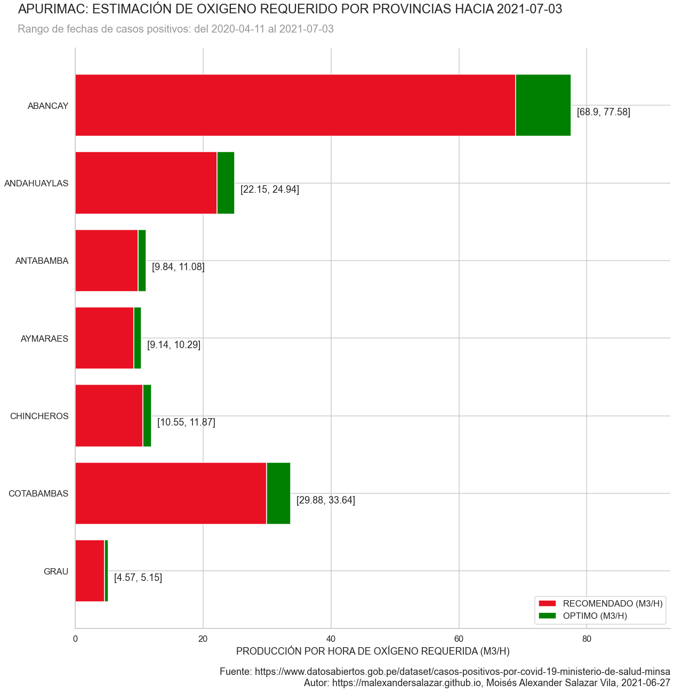

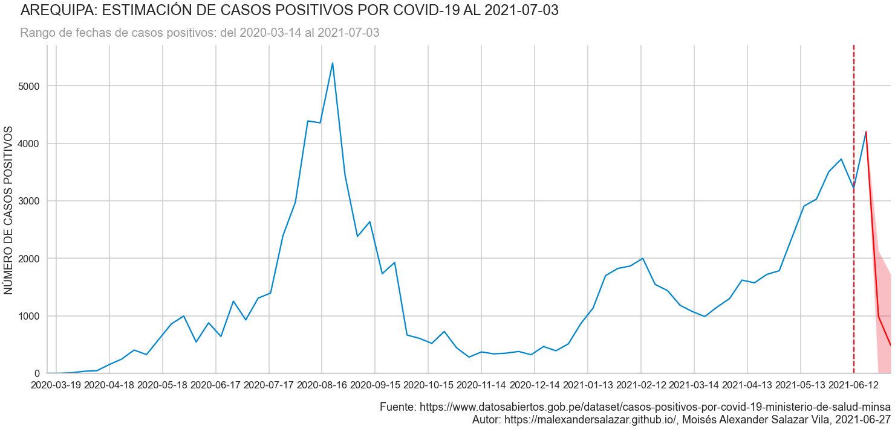

| PROVINCIA   | FECHA PRONÓSTICO   |   PROD. RECOMENDADA |   PROD. IDEAL |
|:------------|:-------------------|--------------------:|--------------:|
| AREQUIPA    | 2021-07-03         |           809.337   |     1295.41   |
| CAMANA      | 2021-07-03         |            16.3502  |       26.17   |
| CARAVELI    | 2021-07-03         |             8.40221 |       13.4485 |
| CASTILLA    | 2021-07-03         |            30.6567  |       49.0687 |
| CAYLLOMA    | 2021-07-03         |            52.2299  |       83.5986 |
| CONDESUYOS  | 2021-07-03         |             6.58551 |       10.5407 |
| ISLAY       | 2021-07-03         |            22.0274  |       35.2568 |
| LA UNION    | 2021-07-03         |             1.58961 |        2.5443 |

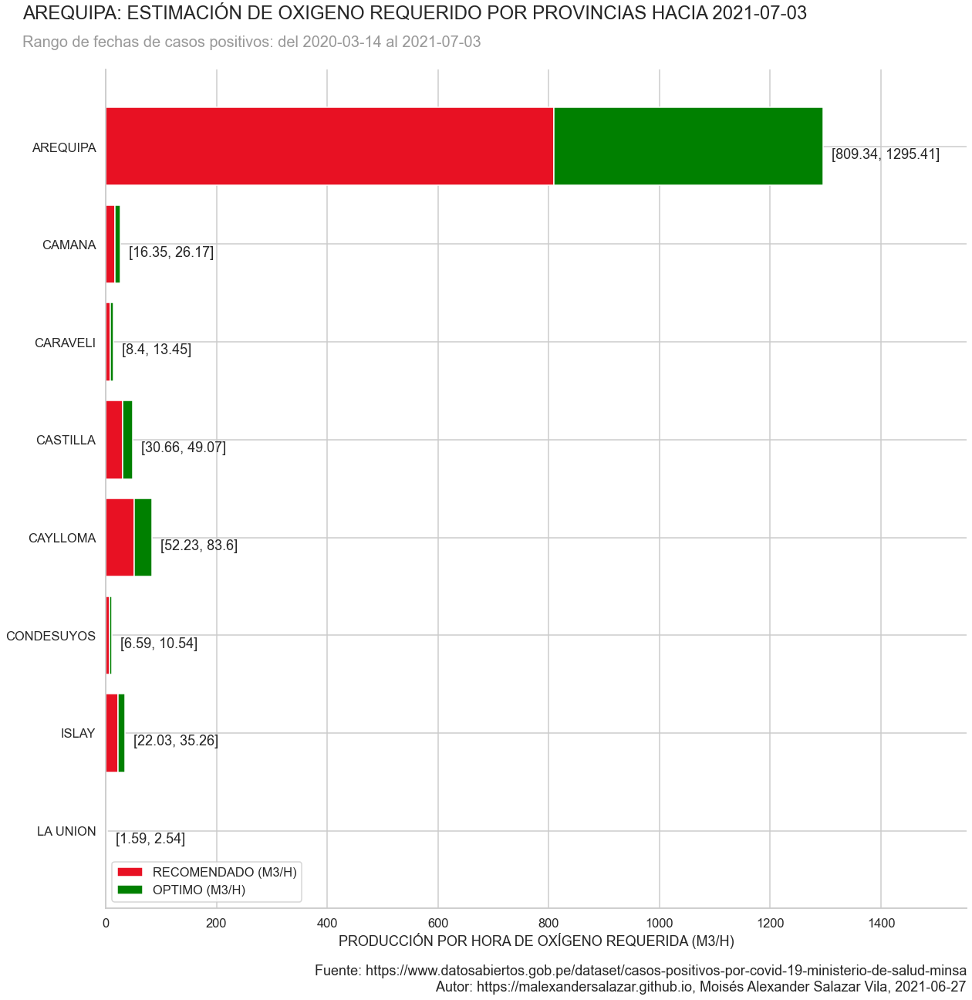

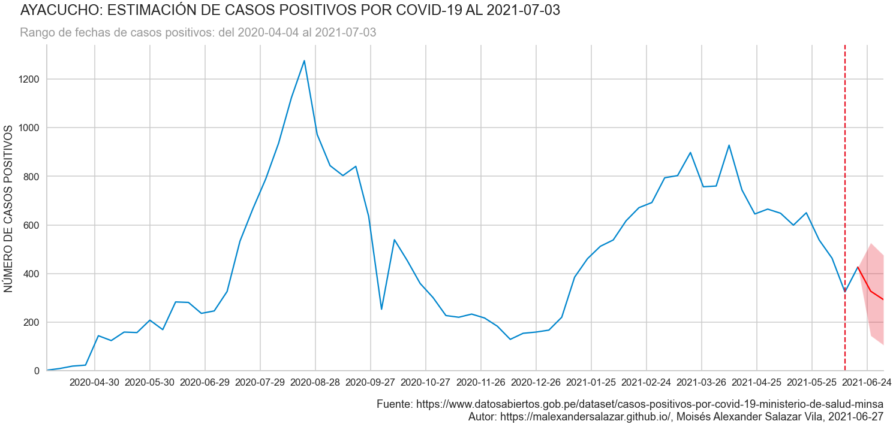

| PROVINCIA            | FECHA PRONÓSTICO   |   PROD. RECOMENDADA |   PROD. IDEAL |
|:---------------------|:-------------------|--------------------:|--------------:|
| CANGALLO             | 2021-07-03         |             4.70214 |       6.01145 |
| HUAMANGA             | 2021-07-03         |            63.9491  |      81.7558  |
| HUANTA               | 2021-07-03         |            10.0312  |      12.8244  |
| LA MAR               | 2021-07-03         |             4.07519 |       5.20993 |
| LUCANAS              | 2021-07-03         |            15.3603  |      19.6374  |
| PARINACOCHAS         | 2021-07-03         |             6.583   |       8.41604 |
| PAUCAR DEL SARA SARA | 2021-07-03         |             8.15037 |      10.4199  |
| SUCRE                | 2021-07-03         |             6.26952 |       8.01527 |
| VICTOR FAJARDO       | 2021-07-03         |             1.88086 |       2.40458 |
| VILCAS HUAMAN        | 2021-07-03         |             3.76171 |       4.80916 |

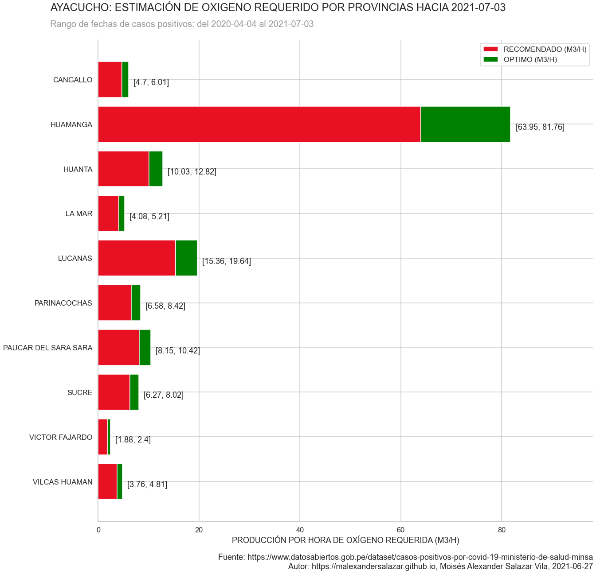

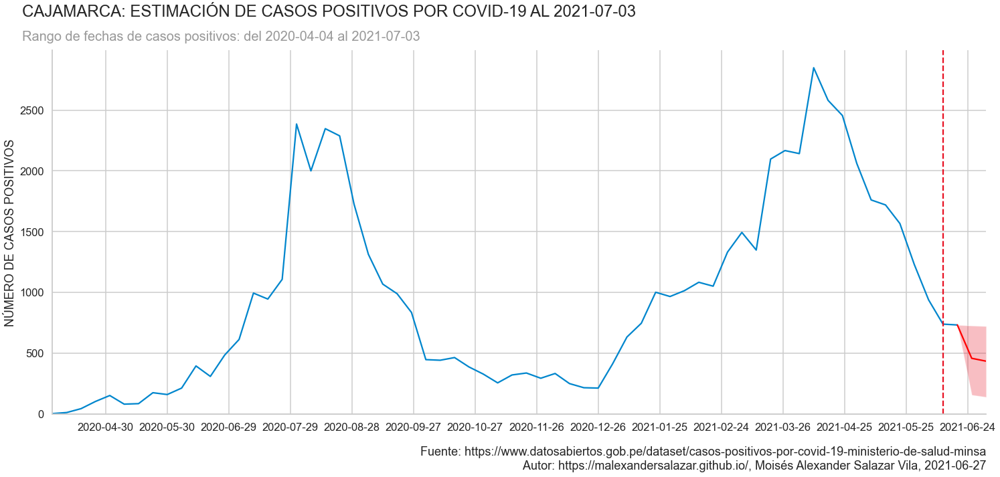

| PROVINCIA   | FECHA PRONÓSTICO   |   PROD. RECOMENDADA |   PROD. IDEAL |
|:------------|:-------------------|--------------------:|--------------:|
| CAJABAMBA   | 2021-07-03         |            11.1125  |      14.3165  |
| CAJAMARCA   | 2021-07-03         |            67.2925  |      86.6943  |
| CHOTA       | 2021-07-03         |            25.6206  |      33.0075  |
| CUTERVO     | 2021-07-03         |             9.26044 |      11.9304  |
| HUALGAYOC   | 2021-07-03         |             8.95176 |      11.5327  |
| JAEN        | 2021-07-03         |            60.1929  |      77.5476  |
| SAN IGNACIO | 2021-07-03         |            20.9903  |      27.0423  |
| SAN MARCOS  | 2021-07-03         |             2.46945 |       3.18144 |
| SAN MIGUEL  | 2021-07-03         |             3.70418 |       4.77216 |
| SANTA CRUZ  | 2021-07-03         |             5.55626 |       7.15824 |

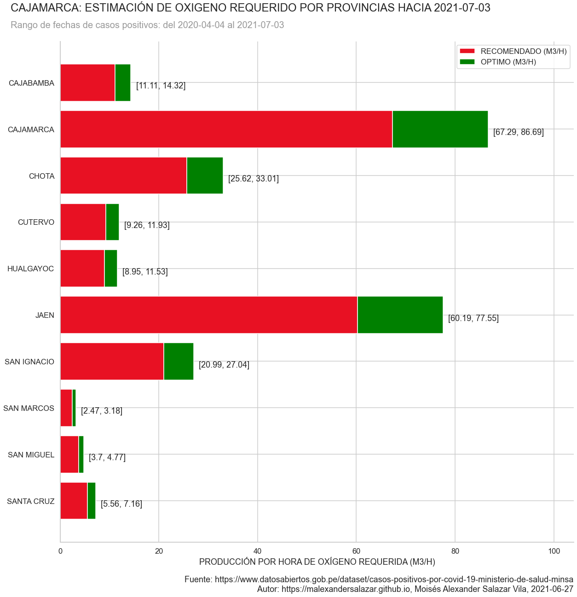

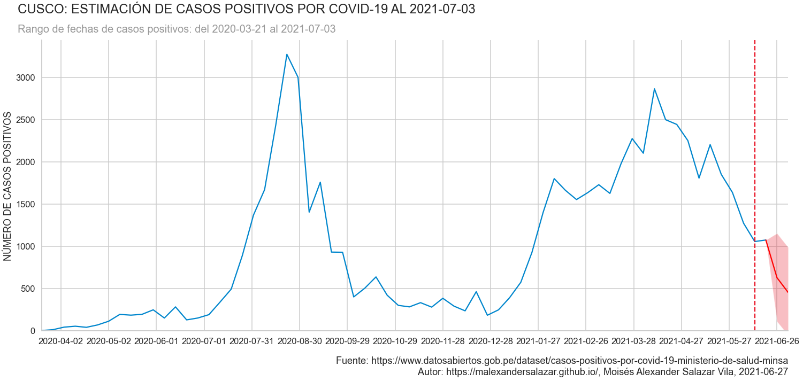

| PROVINCIA     | FECHA PRONÓSTICO   |   PROD. RECOMENDADA |   PROD. IDEAL |
|:--------------|:-------------------|--------------------:|--------------:|
| ACOMAYO       | 2021-07-03         |             4.55145 |       6.42369 |
| ANTA          | 2021-07-03         |             4.01598 |       5.66796 |
| CALCA         | 2021-07-03         |             4.01598 |       5.66796 |
| CANAS         | 2021-07-03         |             8.2997  |      11.7138  |
| CANCHIS       | 2021-07-03         |            33.7343  |      47.6109  |
| CHUMBIVILCAS  | 2021-07-03         |             9.37063 |      13.2252  |
| CUSCO         | 2021-07-03         |           149.127   |     210.47    |
| ESPINAR       | 2021-07-03         |             8.83517 |      12.4695  |
| LA CONVENCION | 2021-07-03         |            39.0889  |      55.1681  |
| PARURO        | 2021-07-03         |             2.94506 |       4.1565  |
| PAUCARTAMBO   | 2021-07-03         |             1.87413 |       2.64505 |
| QUISPICANCHI  | 2021-07-03         |            12.3157  |      17.3817  |
| URUBAMBA      | 2021-07-03         |             7.4965  |      10.5802  |

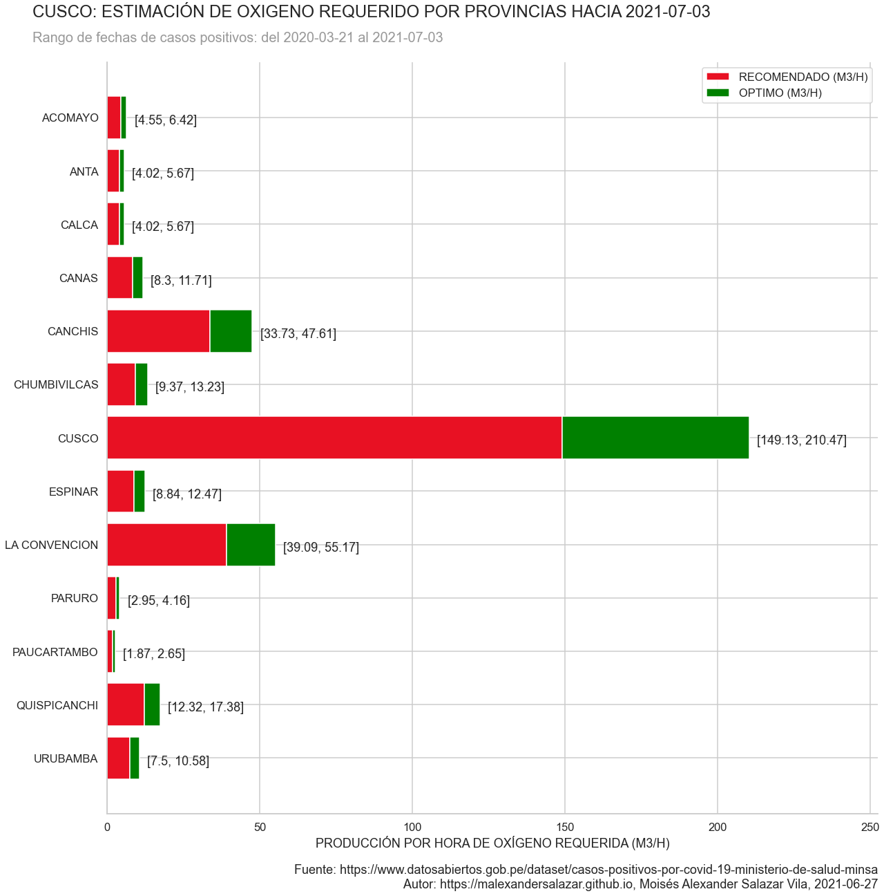

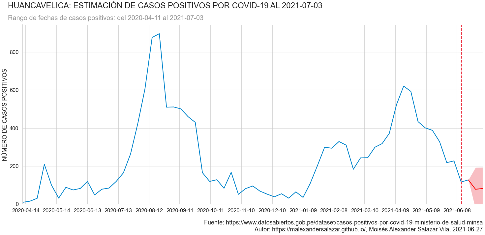

| PROVINCIA    | FECHA PRONÓSTICO   |   PROD. RECOMENDADA |   PROD. IDEAL |
|:-------------|:-------------------|--------------------:|--------------:|
| ANGARAES     | 2021-07-03         |             2.99928 |       4.94926 |
| CHURCAMPA    | 2021-07-03         |             4.99881 |       8.24876 |
| HUANCAVELICA | 2021-07-03         |            16.3294  |      26.9459  |
| HUAYTARA     | 2021-07-03         |             4.66555 |       7.69884 |
| TAYACAJA     | 2021-07-03         |            10.9974  |      18.1473  |

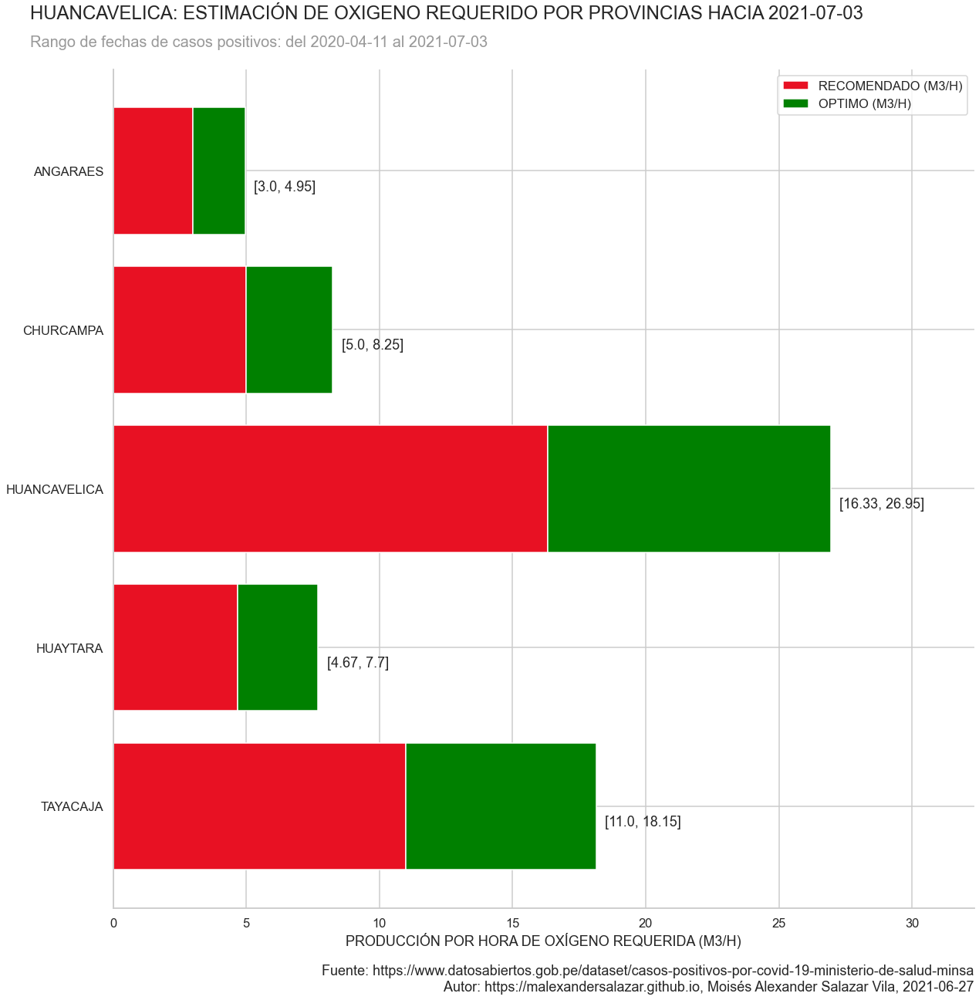

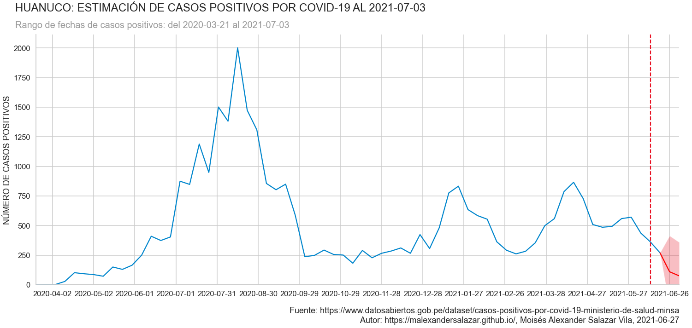

| PROVINCIA     | FECHA PRONÓSTICO   |   PROD. RECOMENDADA |   PROD. IDEAL |
|:--------------|:-------------------|--------------------:|--------------:|
| AMBO          | 2021-07-03         |            9.01363  |     20.0378   |
| DOS DE MAYO   | 2021-07-03         |            1.28766  |      2.86254  |
| HUAMALIES     | 2021-07-03         |            4.37805  |      9.73265  |
| HUANUCO       | 2021-07-03         |           33.4792   |     74.4261   |
| LEONCIO PRADO | 2021-07-03         |            6.18078  |     13.7402   |
| PUERTO INCA   | 2021-07-03         |            3.09039  |      6.8701   |
| YAROWILCA     | 2021-07-03         |            0.257532 |      0.572509 |

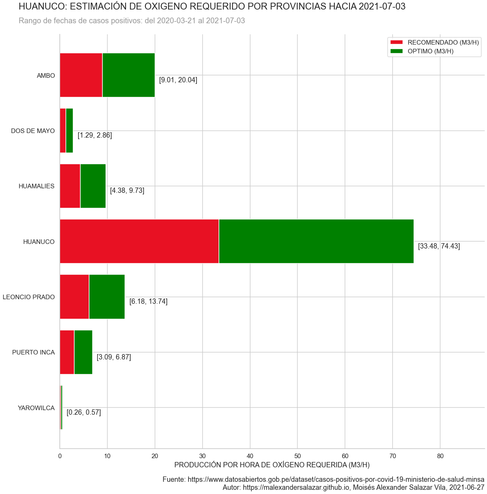

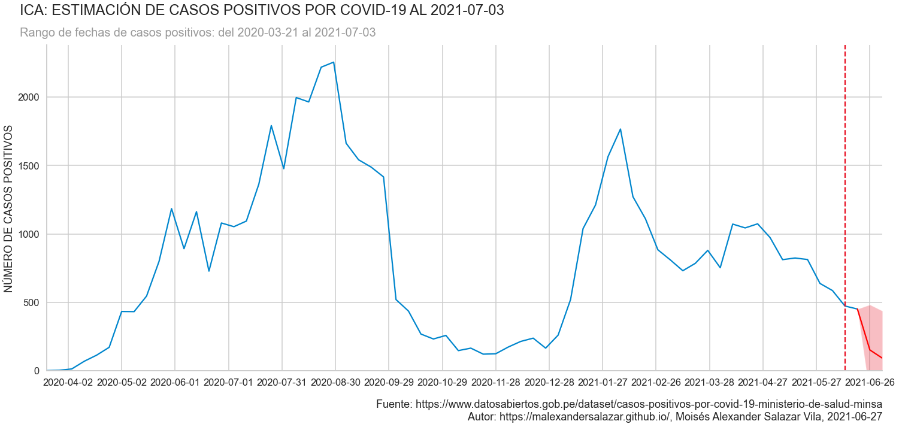

| PROVINCIA   | FECHA PRONÓSTICO   |   PROD. RECOMENDADA |   PROD. IDEAL |
|:------------|:-------------------|--------------------:|--------------:|
| CHINCHA     | 2021-07-03         |            14.7335  |       30.9299 |
| ICA         | 2021-07-03         |            55.7417  |      117.018  |
| NAZCA       | 2021-07-03         |             4.91116 |       10.31   |
| PISCO       | 2021-07-03         |            23.8191  |       50.0033 |

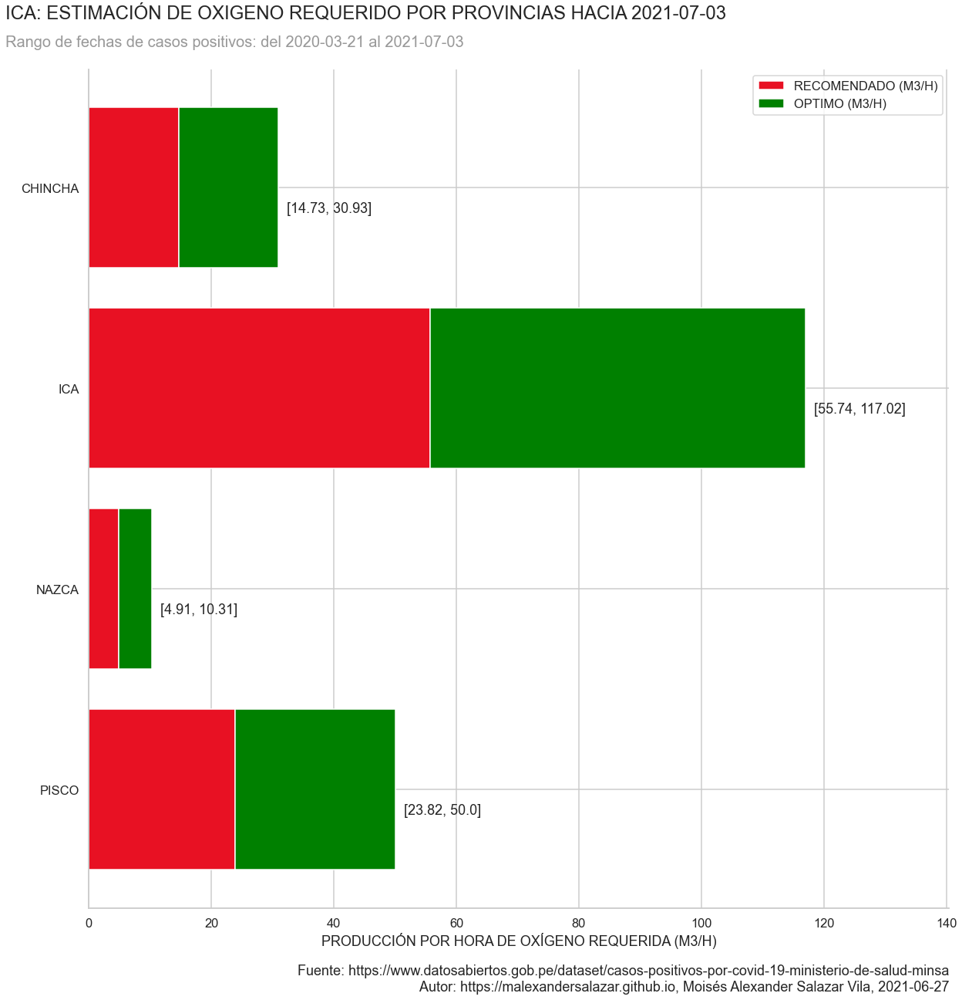

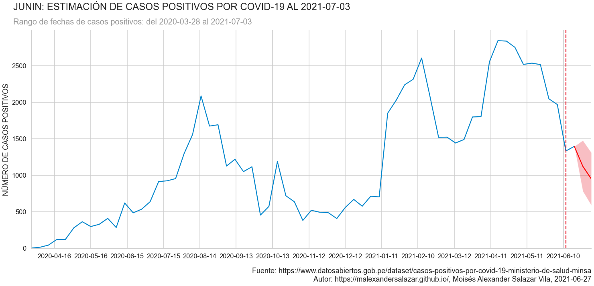

| PROVINCIA   | FECHA PRONÓSTICO   |   PROD. RECOMENDADA |   PROD. IDEAL |
|:------------|:-------------------|--------------------:|--------------:|
| CHANCHAMAYO | 2021-07-03         |            23.7674  |      27.5034  |
| CHUPACA     | 2021-07-03         |            14.8546  |      17.1897  |
| CONCEPCION  | 2021-07-03         |             7.72441 |       8.93862 |
| HUANCAYO    | 2021-07-03         |           257.876   |     298.412   |
| JAUJA       | 2021-07-03         |            27.9267  |      32.3165  |
| JUNIN       | 2021-07-03         |             4.75348 |       5.50069 |
| SATIPO      | 2021-07-03         |            56.1505  |      64.9769  |
| TARMA       | 2021-07-03         |            18.1227  |      20.9714  |
| YAULI       | 2021-07-03         |             2.37674 |       2.75034 |

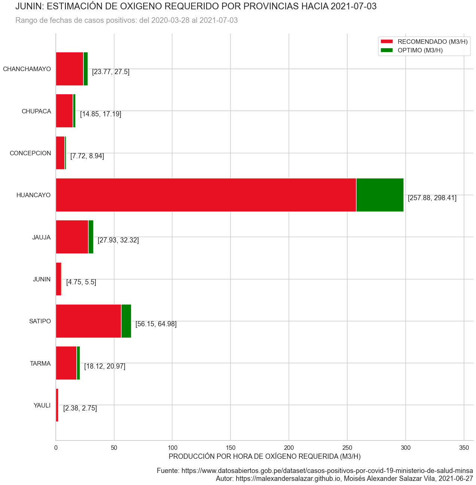

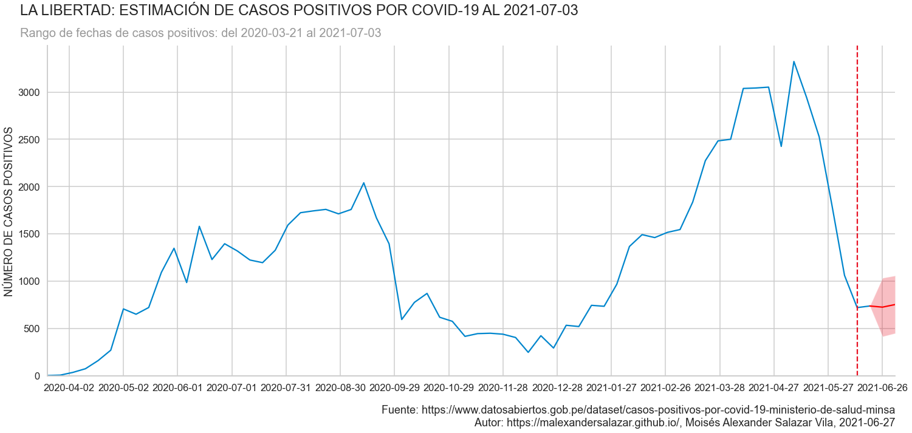

| PROVINCIA       | FECHA PRONÓSTICO   |   PROD. RECOMENDADA |   PROD. IDEAL |
|:----------------|:-------------------|--------------------:|--------------:|
| ASCOPE          | 2021-07-03         |            2.52087  |      3.04917  |
| BOLIVAR         | 2021-07-03         |            0.360124 |      0.435596 |
| CHEPEN          | 2021-07-03         |           10.0835   |     12.1967   |
| GRAN CHIMU      | 2021-07-03         |            5.04174  |      6.09834  |
| JULCAN          | 2021-07-03         |            1.80062  |      2.17798  |
| OTUZCO          | 2021-07-03         |            7.20249  |      8.71192  |
| PACASMAYO       | 2021-07-03         |           25.2087   |     30.4917   |
| SANCHEZ CARRION | 2021-07-03         |           13.3246   |     16.1171   |
| TRUJILLO        | 2021-07-03         |          193.027    |    233.479    |
| VIRU            | 2021-07-03         |            2.52087  |      3.04917  |

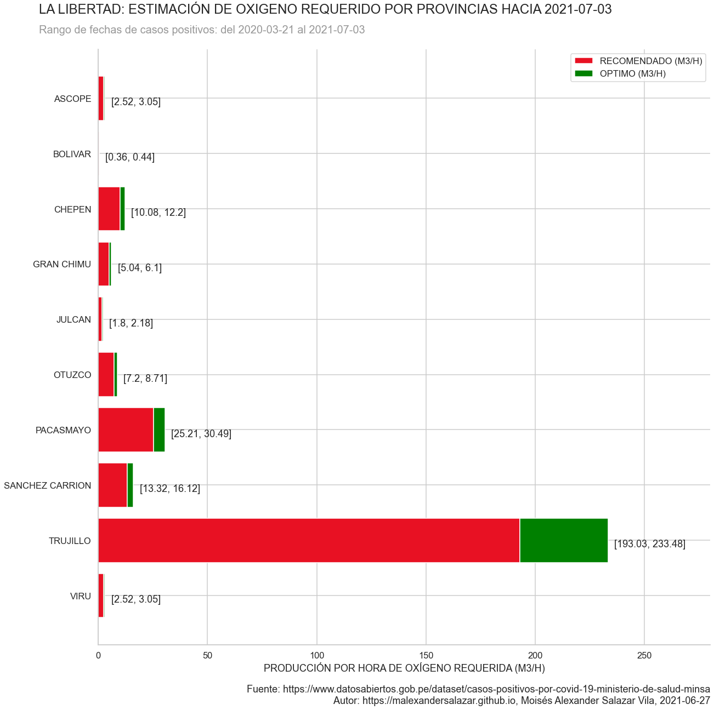

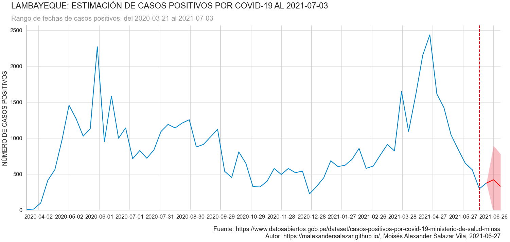

| PROVINCIA   | FECHA PRONÓSTICO   |   PROD. RECOMENDADA |   PROD. IDEAL |
|:------------|:-------------------|--------------------:|--------------:|
| CHICLAYO    | 2021-07-03         |             78.7287 |      121.834  |
| LAMBAYEQUE  | 2021-07-03         |             21.1294 |       32.6981 |

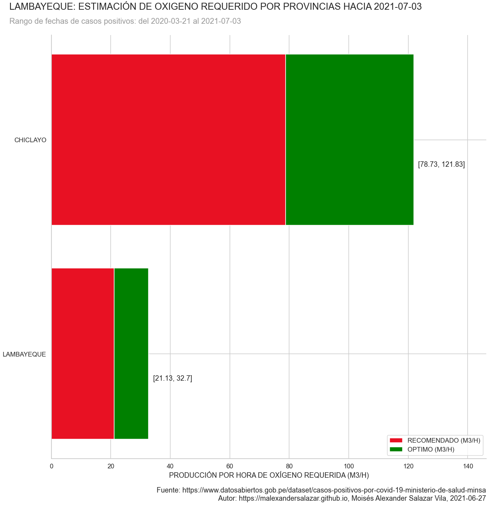

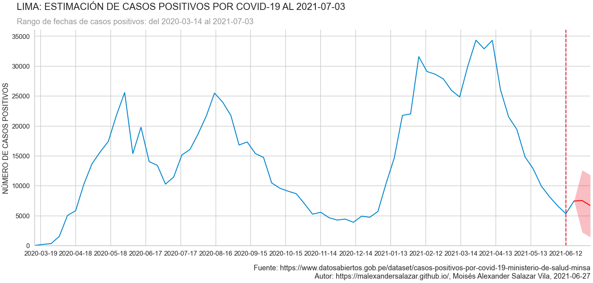

| PROVINCIA   | FECHA PRONÓSTICO   |   PROD. RECOMENDADA |   PROD. IDEAL |
|:------------|:-------------------|--------------------:|--------------:|
| BARRANCA    | 2021-07-03         |            14.3231  |     19.2662   |
| CAJATAMBO   | 2021-07-03         |             6.36581 |      8.56273  |
| CALLAO      | 2021-07-03         |           150.87    |    202.937    |
| CANTA       | 2021-07-03         |             5.09265 |      6.85019  |
| CAÑETE      | 2021-07-03         |             7.63897 |     10.2753   |
| HUARAL      | 2021-07-03         |            23.2352  |     31.254    |
| HUAROCHIRI  | 2021-07-03         |            16.5511  |     22.2631   |
| HUAURA      | 2021-07-03         |            38.5131  |     51.8045   |
| LIMA        | 2021-07-03         |          2000.77    |   2691.27     |
| YAUYOS      | 2021-07-03         |             0.31829 |      0.428137 |

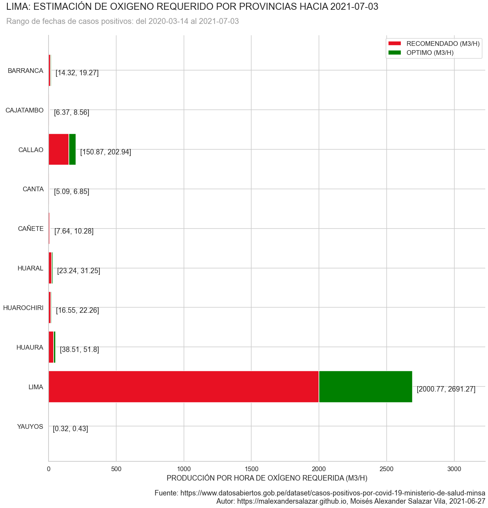

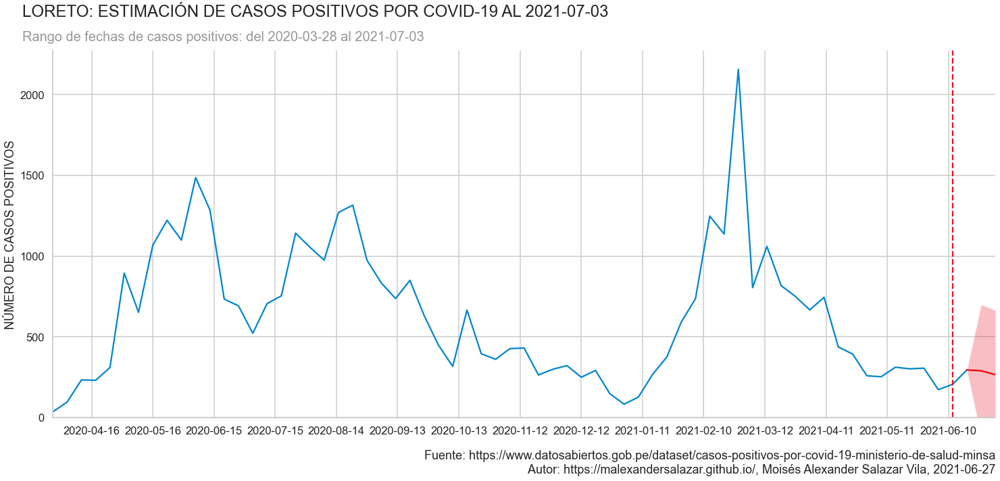

| PROVINCIA               | FECHA PRONÓSTICO   |   PROD. RECOMENDADA |   PROD. IDEAL |
|:------------------------|:-------------------|--------------------:|--------------:|
| DATEM DEL MARAÑON       | 2021-07-03         |             4.97084 |       8.52191 |
| LORETO                  | 2021-07-03         |             1.98834 |       3.40876 |
| MARISCAL RAMON CASTILLA | 2021-07-03         |             3.31389 |       5.68127 |
| MAYNAS                  | 2021-07-03         |            65.6151  |     112.489   |

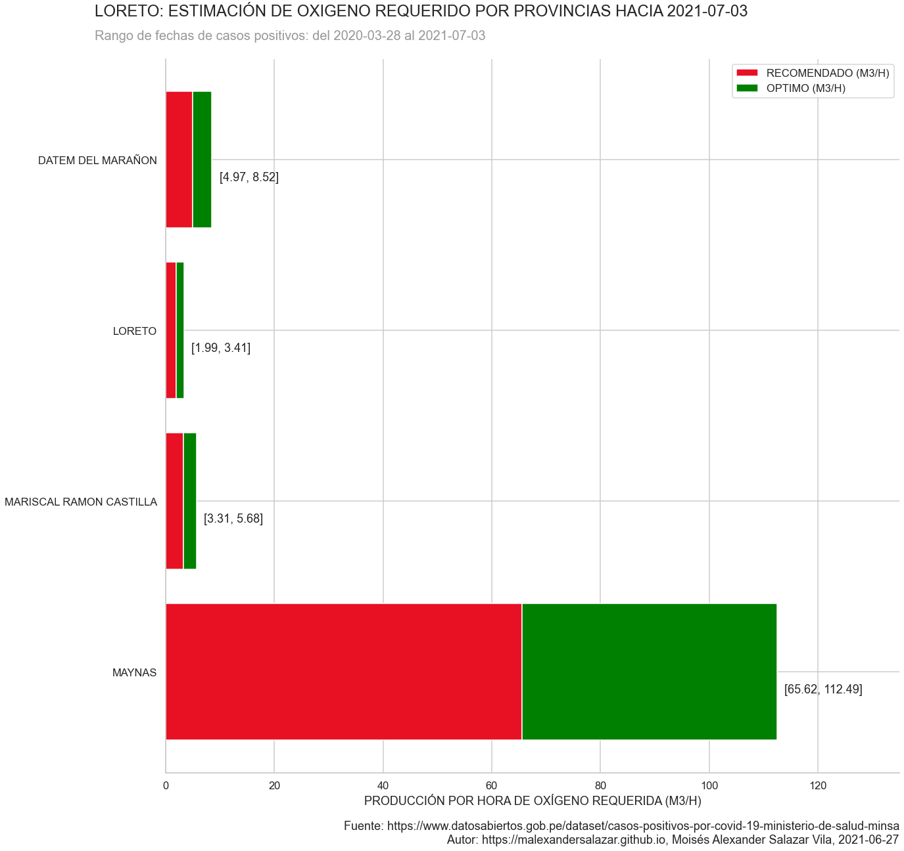

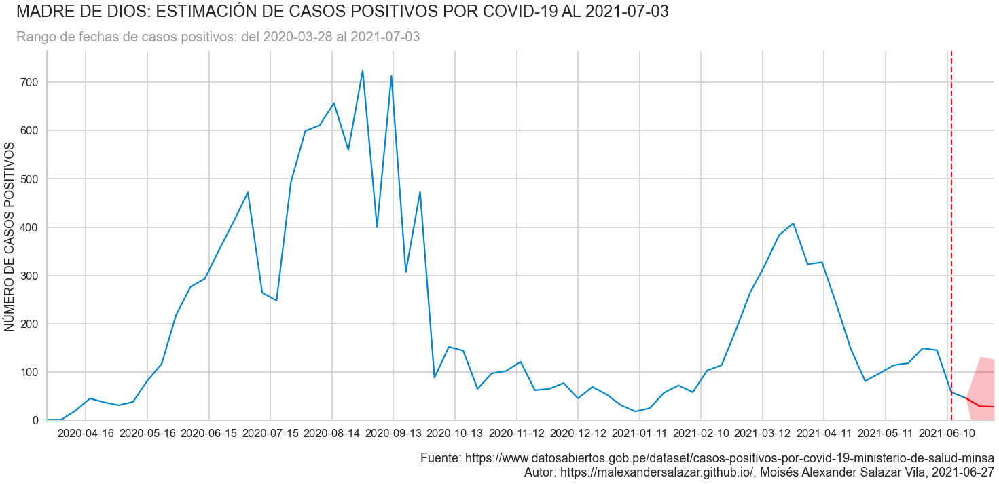

| PROVINCIA   | FECHA PRONÓSTICO   |   PROD. RECOMENDADA |   PROD. IDEAL |
|:------------|:-------------------|--------------------:|--------------:|
| MANU        | 2021-07-03         |             1.99084 |       5.31136 |
| TAHUAMANU   | 2021-07-03         |             4.9771  |      13.2784  |
| TAMBOPATA   | 2021-07-03         |             7.63156 |      20.3602  |

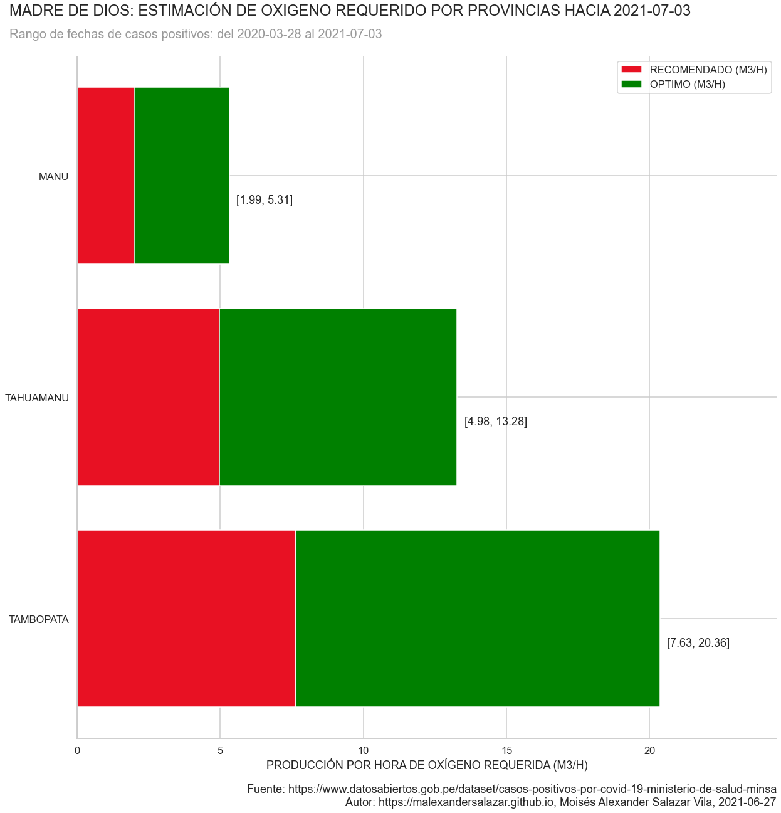

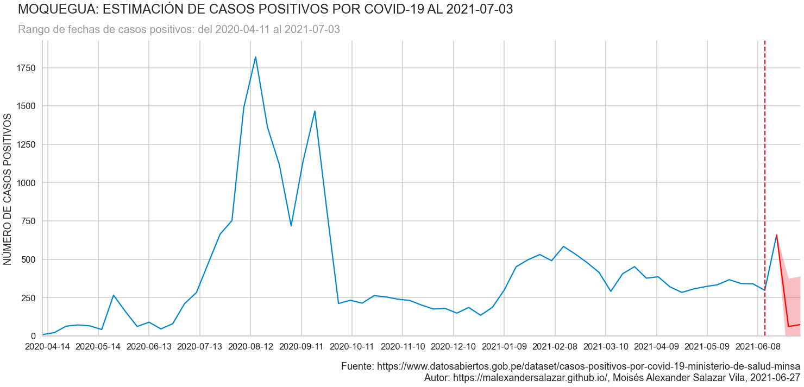

| PROVINCIA             | FECHA PRONÓSTICO   |   PROD. RECOMENDADA |   PROD. IDEAL |
|:----------------------|:-------------------|--------------------:|--------------:|
| GENERAL SANCHEZ CERRO | 2021-07-03         |             12.0201 |       39.6138 |
| ILO                   | 2021-07-03         |             49.2073 |      162.169  |
| MARISCAL NIETO        | 2021-07-03         |            183.682  |      605.348  |

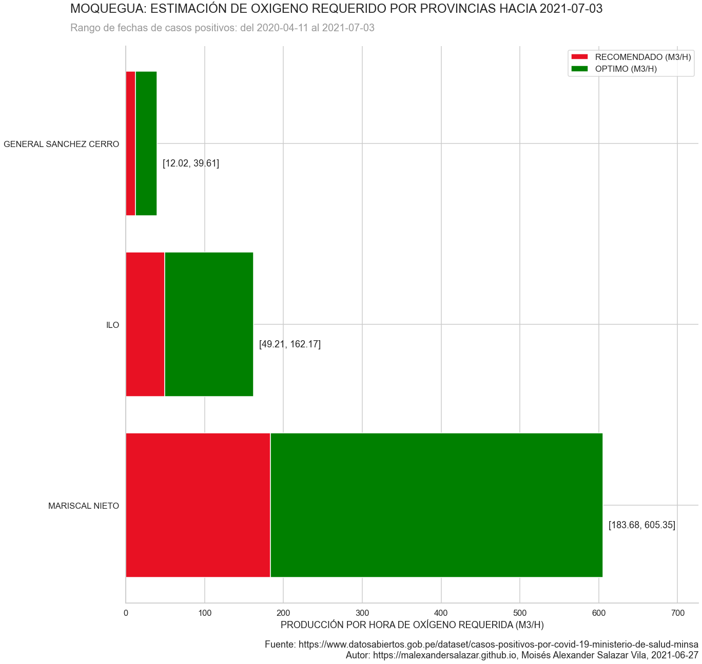

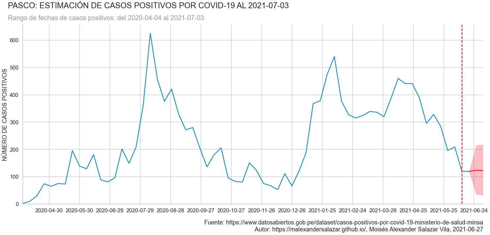

| PROVINCIA              | FECHA PRONÓSTICO   |   PROD. RECOMENDADA |   PROD. IDEAL |
|:-----------------------|:-------------------|--------------------:|--------------:|
| DANIEL ALCIDES CARRION | 2021-07-03         |             1.31196 |       1.79675 |
| OXAPAMPA               | 2021-07-03         |            23.9432  |      32.7907  |
| PASCO                  | 2021-07-03         |            13.7755  |      18.8659  |

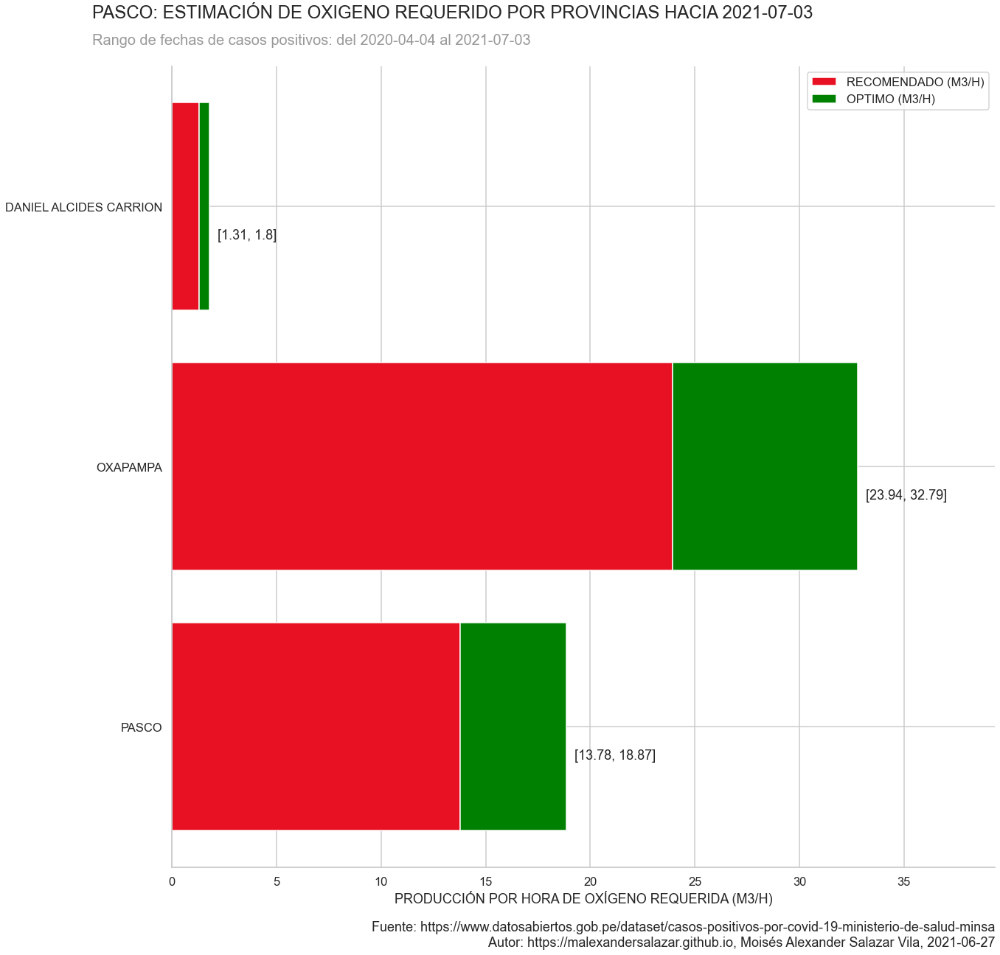

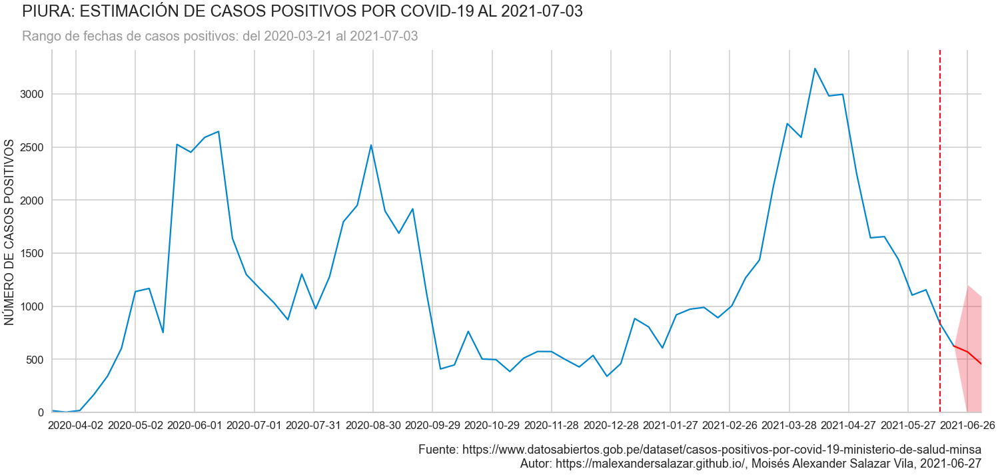

| PROVINCIA   | FECHA PRONÓSTICO   |   PROD. RECOMENDADA |   PROD. IDEAL |
|:------------|:-------------------|--------------------:|--------------:|
| AYABACA     | 2021-07-03         |            13.8367  |      21.7451  |
| HUANCABAMBA | 2021-07-03         |             6.47675 |      10.1785  |
| MORROPON    | 2021-07-03         |            29.4398  |      46.2661  |
| PAITA       | 2021-07-03         |            10.5983  |      16.6558  |
| PIURA       | 2021-07-03         |            76.5434  |     120.292   |
| SECHURA     | 2021-07-03         |             5.00476 |       7.86523 |
| SULLANA     | 2021-07-03         |            27.379   |      43.0274  |
| TALARA      | 2021-07-03         |             7.94873 |      12.4918  |

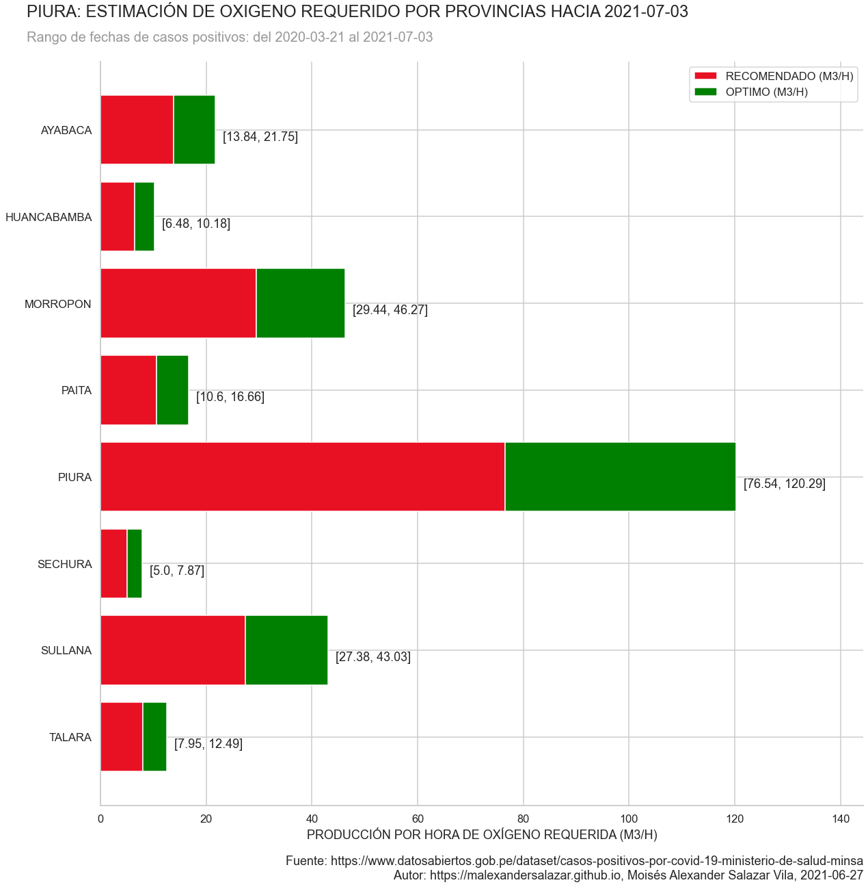

| PROVINCIA             | FECHA PRONÓSTICO   |   PROD. RECOMENDADA |   PROD. IDEAL |
|:----------------------|:-------------------|--------------------:|--------------:|
| AZANGARO              | 2021-07-03         |            8.93274  |      18.7115  |
| CARABAYA              | 2021-07-03         |            6.33937  |      13.2791  |
| CHUCUITO              | 2021-07-03         |            8.35644  |      17.5043  |
| EL COLLAO             | 2021-07-03         |            2.59338  |       5.43237 |
| HUANCANE              | 2021-07-03         |            3.74599  |       7.84676 |
| LAMPA                 | 2021-07-03         |            8.35644  |      17.5043  |
| MELGAR                | 2021-07-03         |           24.2049   |      50.7022  |
| MOHO                  | 2021-07-03         |            0.864459 |       1.81079 |
| PUNO                  | 2021-07-03         |           61.6647   |     129.17    |
| SAN ANTONIO DE PUTINA | 2021-07-03         |            6.62752  |      13.8827  |
| SAN ROMAN             | 2021-07-03         |           49.2742   |     103.215   |
| SANDIA                | 2021-07-03         |            3.45784  |       7.24317 |
| YUNGUYO               | 2021-07-03         |            4.61045  |       9.65755 |

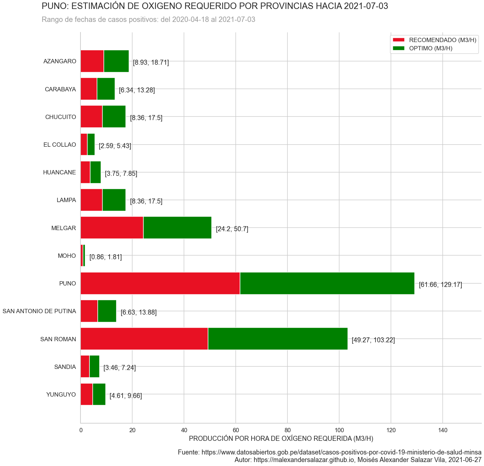

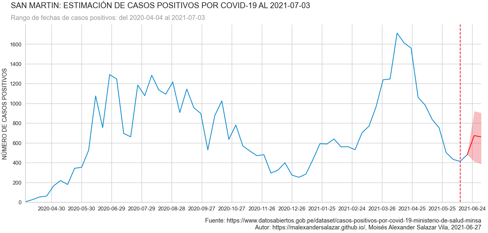

| PROVINCIA        | FECHA PRONÓSTICO   |   PROD. RECOMENDADA |   PROD. IDEAL |
|:-----------------|:-------------------|--------------------:|--------------:|
| BELLAVISTA       | 2021-07-03         |             2.81174 |       3.33635 |
| EL DORADO        | 2021-07-03         |             2.81174 |       3.33635 |
| HUALLAGA         | 2021-07-03         |             8.43521 |      10.009   |
| LAMAS            | 2021-07-03         |            11.5984  |      13.7624  |
| MARISCAL CACERES | 2021-07-03         |             4.56907 |       5.42157 |
| MOYOBAMBA        | 2021-07-03         |            49.2054  |      58.3861  |
| RIOJA            | 2021-07-03         |            12.3013  |      14.5965  |
| SAN MARTIN       | 2021-07-03         |            68.1846  |      80.9065  |
| TOCACHE          | 2021-07-03         |             3.51467 |       4.17044 |

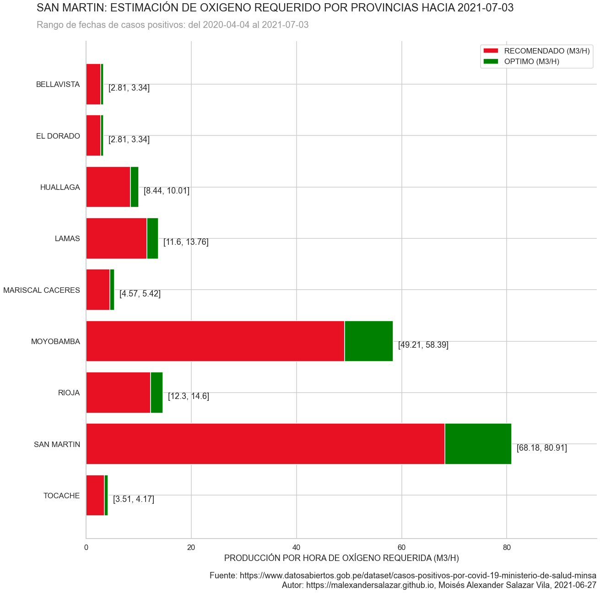

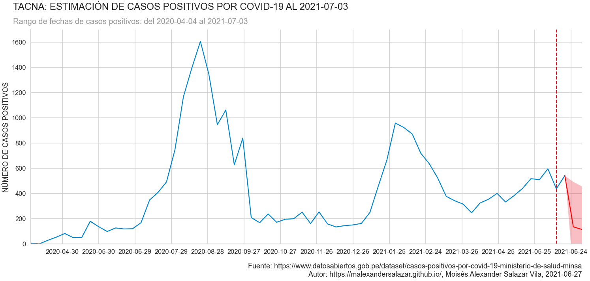

| PROVINCIA     | FECHA PRONÓSTICO   |   PROD. RECOMENDADA |   PROD. IDEAL |
|:--------------|:-------------------|--------------------:|--------------:|
| CANDARAVE     | 2021-07-03         |            0.882334 |       1.95373 |
| JORGE BASADRE | 2021-07-03         |            6.47045  |      14.3273  |
| TACNA         | 2021-07-03         |          150.585    |     333.437   |
| TARATA        | 2021-07-03         |            1.17645  |       2.60497 |

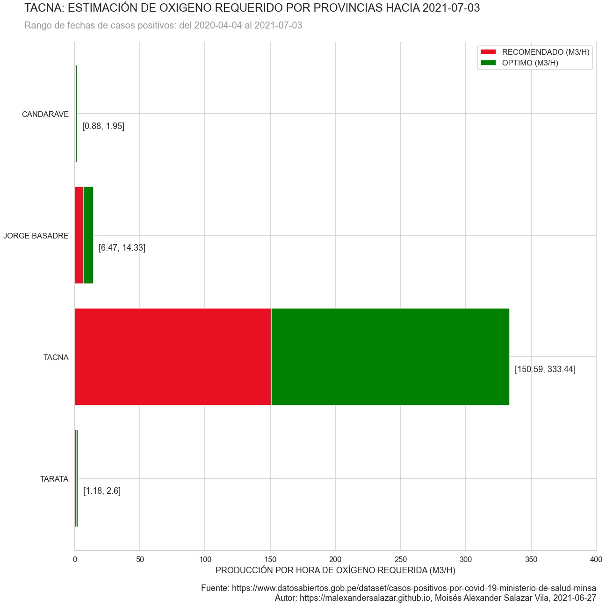

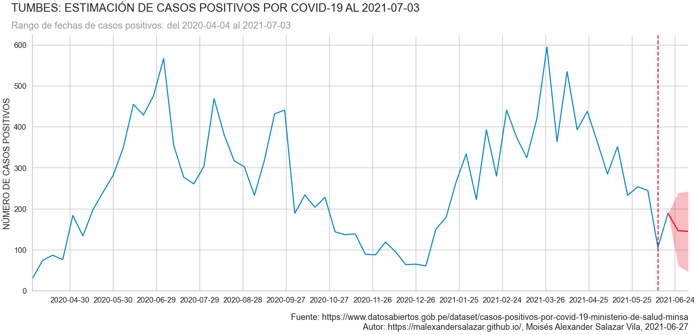

| PROVINCIA             | FECHA PRONÓSTICO   |   PROD. RECOMENDADA |   PROD. IDEAL |
|:----------------------|:-------------------|--------------------:|--------------:|
| CONTRALMIRANTE VILLAR | 2021-07-03         |            0.994637 |        1.3129 |
| TUMBES                | 2021-07-03         |           53.3788   |       70.4591 |
| ZARUMILLA             | 2021-07-03         |            8.28864  |       10.9408 |

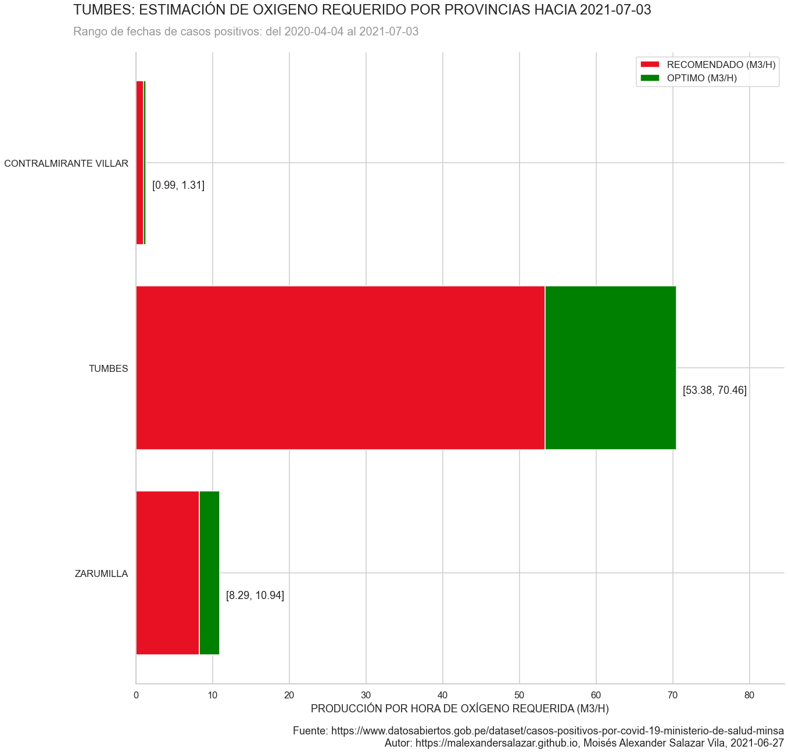

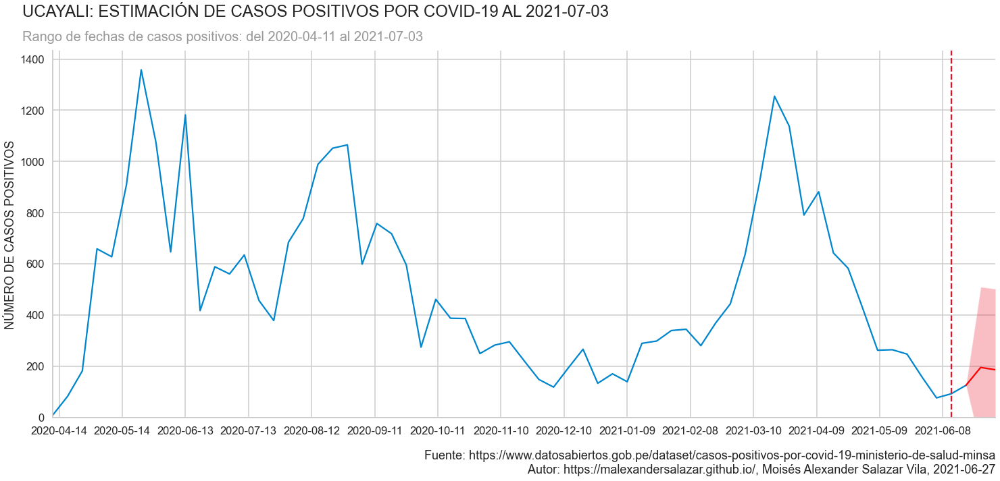

| PROVINCIA        | FECHA PRONÓSTICO   |   PROD. RECOMENDADA |   PROD. IDEAL |
|:-----------------|:-------------------|--------------------:|--------------:|
| CORONEL PORTILLO | 2021-07-03         |             37.7885 |       68.4632 |

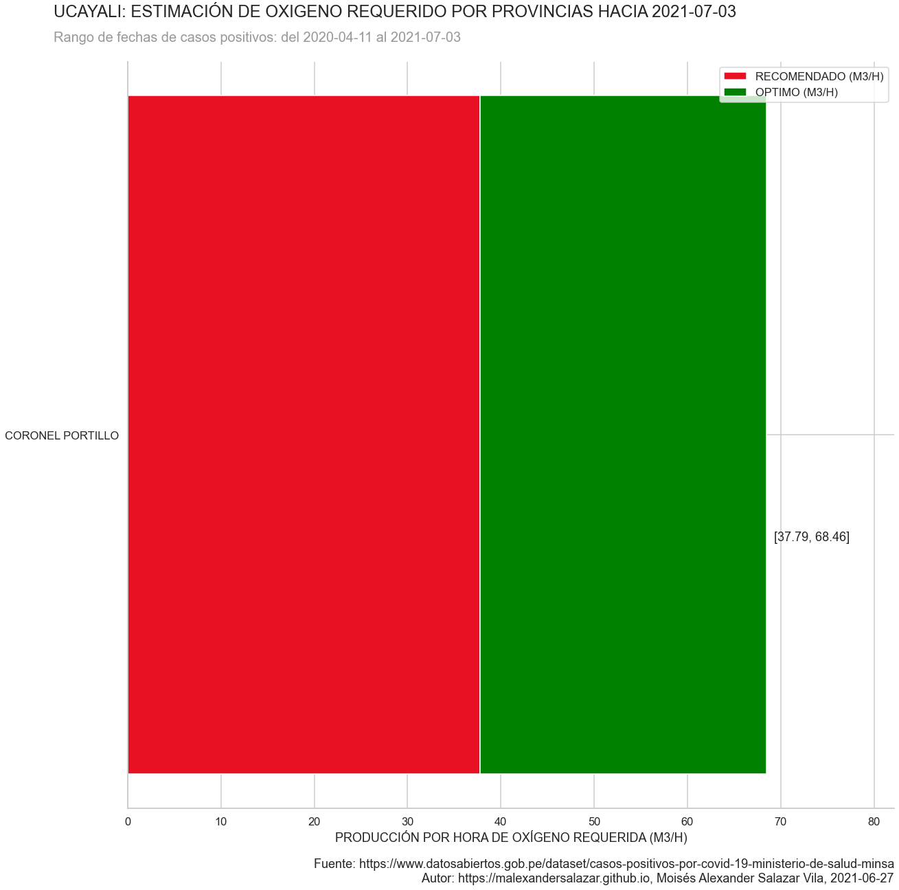

## Discussion 

### Resultados

La mayoría de los modelos predictivos de series de tiempo generados en el presente proyecto logran representar correctamente las tendencias de los casos positivos semanales de COVID-19. Sin embargo, solo en el caso de Arequipa las casos positivos en la segunda ola se disparan por fuera de lo señalado por el modelo, mientras que, en los demás departamentos, la tendencia es claramente a la baja.

Al parecer Arequipa es el único departamento del Perú donde, desde el gobierno regional, se intento usar Dioxido de Cloro para tratar COVID-19 en vez promover responsablemente los protocolos aprobados internacionalmente.

Arequipa: Elmer Cáceres insistió en usar dióxido de cloro contra el coronavirus - https://canaln.pe/peru/arequipa-elmer-caceres-insistio-usar-dioxido-cloro-contra-coronavirus-n421303

Mazzetti respondió sobre el uso de dióxido de cloro recomendando por Elmer Cáceres - https://gestion.pe/peru/coronavirus-peru-pilar-mazzetti-respondio-sobre-el-uso-de-dioxido-de-cloro-recomendando-por-elmer-caceres-cuarentena-estado-de-emergencia-covid-19-nndc-noticia/

### Patrocinio

Si valoras lo que hago, un "Like", "Share" o "Gracias" me motivaría bastante. Sin embargo, para poder dedicarle tiempo de calidad a estos proyectos o actividades, un patrocinio económico, desde el valor de un almuerzo me sería de muchísima ayuda: https://www.patreon.com/malexandersalazar

## Referencias

1. World Health Organization - WHO. (07 de octubre de 2021). _Orientaciones para el público_. World Health Organization. Recuperado el 24 de abril de 2021 de https://www.who.int/emergencies/diseases/novel-coronavirus-2019/advice-for-public

[1]: https://www.who.int/emergencies/diseases/novel-coronavirus-2019/advice-for-public

2. Ministerio de Salud - MINSA. (s.f.). _Casos positivos por COVID-19 -  [Ministerio de Salud - MINSA] | Plataforma Nacional de Datos Abiertos_. Gobierno del Perú. Recuperado el 24 de junio de 2021 de https://www.datosabiertos.gob.pe/dataset/casos-positivos-por-covid-19-ministerio-de-salud-minsa

[2]: https://www.datosabiertos.gob.pe/dataset/casos-positivos-por-covid-19-ministerio-de-salud-minsa

3. World Health Organization - WHO. (04 de abril de 2020). _Oxygen sources and distribution for COVID-19 treatment centres: interim guidance, 4 April 2020_. World Health Organization. Recuperado el 24 de junio de 2021 de https://apps.who.int/iris/handle/10665/331746

[3]: https://apps.who.int/iris/handle/10665/331746

4. Organización Panamericana de la Salud - OPS. (s.f.). _Respuesta a la emergencia por COVID-19 en Perú - OPS/OMS | Organización Panamericana de la Salud_. Organización Mundial de la Salud. Recuperado el 24 de junio de 2021 de https://www.paho.org/es/respuesta-emergencia-por-covid-19-peru

[4]: https://www.paho.org/es/respuesta-emergencia-por-covid-19-peru

5. Moisés Alexander Salazar Vila. (s.f.). _malexandersalazar/covid-19-peru-analisis-oleadas: Análisis técnico de defunciones por COVID-19 en Perú para la detección de oleadas de COVID-19_. Microsoft GitHub. Recuperado el 7 de mayo de 2021 de https://github.com/malexandersalazar/covid-19-peru-analisis-oleadas

[5]: https://github.com/malexandersalazar/covid-19-peru-analisis-oleadas

6. Prophet. (s.f.). _Prophet | Forecasting at scale._. Facebook. Recuperado el 25 de junio de 2021 de https://facebook.github.io/prophet/

[6]: https://facebook.github.io/prophet/

